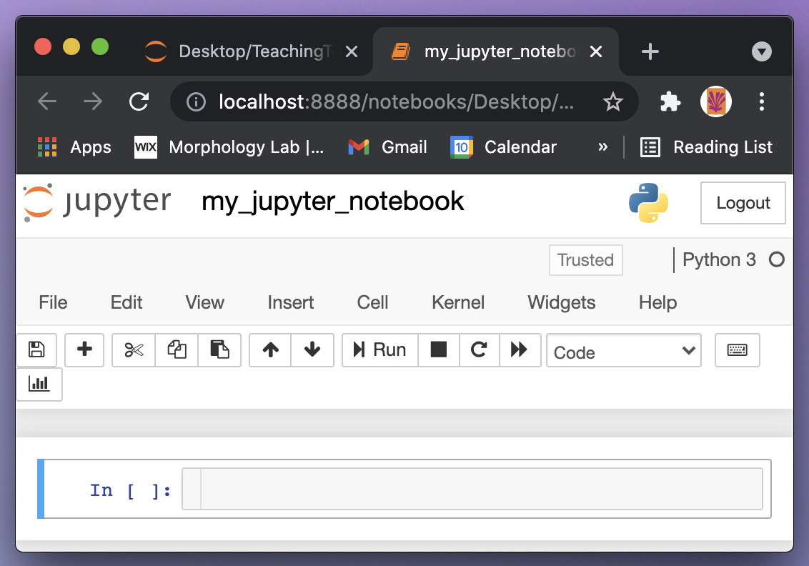

# Installing Anaconda and using Jupyter notebooks / Instalar Anaconda y usar Jupyter notebooks
_____

**Watch this video from 0:00 to 3:33 / Mira este video de 0:00 a 3:33**  
Para español, haga click en configuración, seleccione "español" debajo de los subtítulos. Traducción por Dr. Alejandra Rougon (UNAM ENES León, México)

<iframe width="560" height="315" src="https://www.youtube.com/embed/FrDYpLVuTkQ?si=-sY2dBorReYbpSiZ" title="YouTube video player" frameborder="0" allow="accelerometer; autoplay; clipboard-write; encrypted-media; gyroscope; picture-in-picture; web-share" referrerpolicy="strict-origin-when-cross-origin" allowfullscreen></iframe>

=== "English :flag_us:" 

    In this tutorial we're going to learn how to download Anaconda and get going with Jupyter notebooks. The first step, of course, is to download and install Anaconda. With Anaconda will come Python, Jupyter, and a number of Python modules that are necessary for us to do analyses. 

    **Go to [https://docs.anaconda.com/anaconda/install](https://docs.anaconda.com/anaconda/install)**

    This link might change with time but if you can find Anaconda and where to download it and install it there should always be instructions. Once on the installation page, click on the link for your operating system.  For example, if you're using Windows click on "Installing on Windows" and there will be detailed instructions for download and install. The same for macOS, as well as for Linux.  

    Once you have followed the instructions, downloaded, and installed Anaconda you should  be able to load Jupyter. To load Jupyter on macOS or linux there's an application called terminal  that gets you to the terminal. On Windows you need to go to the command prompt. Once you're at the command line simply type "jupyter" and remember there's a "y" not an "i". It's jupyter with a "y", space, "notebook": "jupyter notebook". And press enter. Jupyter should load. 

    

    It will load up in your browser. I'm using Chrome, for example. Jupyter is not using the internet. It's running  locally on your own computer and it's just using the browser to display the interface. The Jupyter interface shows you your home directory or whatever directory you've chosen for it to display. Once you're here at the Jupyter interface you can go to the right hand corner under new and create a new notebook.

    

    You can click on the title at the top and give it a name. You can say "my_jupyter_notebook" for a name, for example, and rename it.  

    

    

    Jupyter notebooks consist of cells. Cells are everything that a Jupyter notebook is, so it's important to be able to create them and to delete them. Some really convenient shortcuts are "a", "b" and "x". "a" and "b" will create a new cell above or below. So if you click on the left side of the cell near the blue bar and you press "a" you'll create a cell above. If you press "b" you'll create a new cell below. And it's easy to create as many cells as you want and importantly "x" is a convenient way to delete a cell.

    

    There are two main types of cells in Jupyter. There are coding cells and there are markdown cells. By default the cells are coding and you can change them up here on this drop down menu. Right now it's a coding cell but we can change it to a markdown cell. Notice that when we create a markdown cell that the little prompt on the left goes a way. You can also use shortcuts to convert between coding and markdown cells. You use "m" to change it to markdown and you press "y" to change it back to coding.  

    

=== "Español :flag_mx:"

    En este tutorial aprenderemos a descargar Anaconda y empezaremos a usar los Jupyter notebooks. El primer paso, por supuesto, es descargar e instalar Anaconda. Con Anaconda vendrán Python, Jupyter y varios módulos de Python que son necesarios para que hagamos los análisis.

    **Ve a [https://docs.anaconda.com/anaconda/install](https://docs.anaconda.com/anaconda/install)**

    Este enlace puede cambiar con el tiempo, pero si puedes encontrar Anaconda y dónde descargarlo e instalarlo, siempre debería haber instrucciones. Una vez en la página de instalación, haz clic en el enlace específico para tu sistema operativo. Por ejemplo, si estás utilizando Windows, haz clic en "Instalar en Windows" y habrá instrucciones detalladas para descargarlo e instalarlo. Lo mismo para macOS y para Linux.

    Una vez que hayas seguido las instrucciones, y hayas descargado e instalado Anaconda, debes poder cargar Jupyter. Para cargar Jupyter en macOS o linux hay una aplicación llamada terminal que te lleva a la terminal. En Windows, debes ir a la consola de comandos. Una vez que estés en la línea de comandos simplemente escribe "jupyter" y recuerde que lleva una "y" no una "i". Es jupyter con una "y", espacio, "notebook": "jupyter notebook". Y presiona enter. Jupyter debería cargarse. 

    

    Se cargará en el navegador. Por ejemplo, yo estoy usando Chrome. Jupyter no utiliza Internet. Corre localmente en tu propia computadora y solo usa el navegador para mostrar la interfaz.

    La interfaz de Jupyter te muestra tu directorio de inicio o cualquier directorio que hayas elegido para que se muestre. Una vez que estés aquí en la interfaz de Jupyter, puedes ir a la esquina derecha bajo nuevo y crea un nuevo 'notebook'. 

    

    Puedes hacer clic en el título en la parte superior y darle un nombre. Puede ser, por ejemplo, "my_jupyter_notebook" y también puedes cambiarle el nombre.

    

    

    Los Jupyter notebooks contienen celdas. Las celdas son todo lo que es un Jupyter notebook, por lo que es importante poder crearlos y eliminarlos. Algunos atajos realmente convenientes son "a", "b" y "x". "a" y "b" crearán una nueva celda arriba o abajo. Entonces, si haces clic en el lado izquierdo de la celda cerca de la barra azul y presionas "a" crearás una celda arriba. Si presiona "b", crearás una nueva celda abajo. Es fácil crear tantas celdas como desees. "x" es una forma conveniente de eliminaruna celda.

    

    Hay dos tipos principales de celdas en Jupyter. Hay celdas de código y celdas de 'markdown'. Por defecto, las celdas que aparecen son las de código. Y puedes cambiarlas aquí en este menú desplegable. Esta es una celda de código, pero podemos cámbiarla a una celda de markdown. Observa que cuando creamos una celda de markdown, el pequeño mensaje de la izquierda desaparece. También puede usar atajos para convertir entre celdas de código y markdown. Usas "m" para cambiarlo a markdown y presionas "y" para cambiarlo de nuevo a código.

    