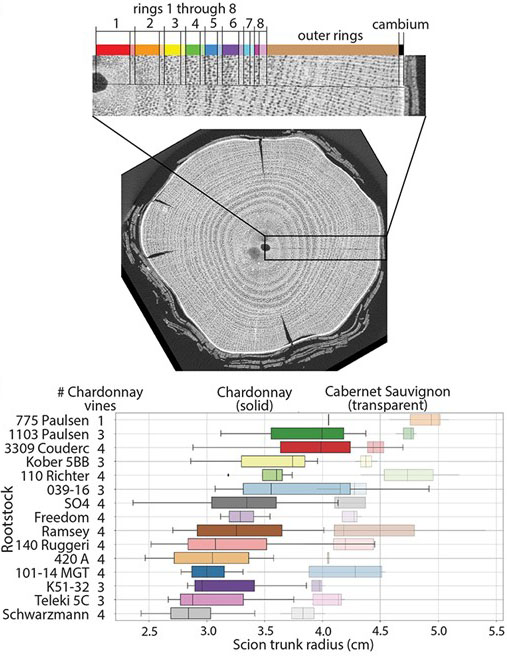

# Class publications
__________
## Plants&Python  

###**Plants & Python: A series of lessons in coding, plant biology, computation, and bioinformatics.**  

*The Plant Cell*, Volume 34, Issue 7, July 2022, page e1  
[https://doi.org/10.1093/plcell/koac187](https://doi.org/10.1093/plcell/koac187)  
Published: 04 July 2022

Robert VanBuren1,\*, Alejandra Rougon-Cardoso2,\*, Erik J. Amézquita1, Evelia L. Coss-Navarrete3, Aarón Espinosa-Jaime2, Omar Andres Gonzalez-Iturbe3, Alicia C. Luckie-Duque2, Eddy Mendoza-Galindo2, Jeremy Pardo1, Guillermo Rodríguez-Guerrero2, Pablo Y. Rosiles-Loeza3, Marilyn Vásquez-Cruz3, Selene L. Fernandez-Valverde3, Tania Hernández-Hernández4, Sourabh Palande1, Daniel H. Chitwood1  
*These authors contributed equally

1Michigan State University, East Lansing, Michigan, USA; 2Laboratory of Agrigenomic Sciences, Universidad Nacional Autónoma de México, ENES-León, León, Guanajuato, México; 3Laboratorio Nacional de Genómica para la Biodiversidad (Langebio)-Centro de Investigación y de Estudios Avanzados (Cinvestav), Irapuato, Guanajuato, México; 4Desert Botanical Garden, Phoenix, Arizona, USA

Group photo from [write-up](https://plantae.org/new-teaching-tool-plants-and-python/) by Mary Williams.
__________

## Educational research  

###**Interdisciplinarity through internationality: Results from a US–Mexico graduate course bridging computational and plant science.**  

*Plant Direct*, Volume 8, Issue 10, October 2024, page e70019  
[https://doi.org/10.1002/pld3.70019](https://doi.org/10.1002/pld3.70019)  
Published: 25 October 2024

Daniel H. Chitwood1,\*, Alejandra Rougon-Cardoso2,\*, Robert VanBuren1,\*  
*These authors contributed equally

1Michigan State University, East Lansing, Michigan, USA; 2Laboratory of Agrigenomic Sciences, Universidad Nacional Autónoma de México, ENES-León, León, Guanajuato, México

_____________
## HRT812: Laboratory Research Techniques | UC Davis VEN101A: Viticultural Practices | Fall 2023 

###**A high-resolution model of the grapevine leaf morphospace predicts synthetic leaves**

*Plants, People, Planet*, Volume 7, Issue 1, January 2025, pages 133-146 
[https://doi.org/10.1002/ppp3.10561](https://doi.org/10.1002/ppp3.10561)  
Published: 20 August 2024   

Daniel H. Chitwood, Efrain Torres-Lomas, Ebi S. Hadi, Wolfgang L. G. Peterson, Mirjam F. Fischer, Sydney E. Rogers, Chuan He, Michael G. F. Acierno, Shintaro Azumaya, Seth Wayne Benjamin, Devendra Prasad Chalise, Ellice E. Chess, Alex J. Engelsma, Qiuyi Fu, Jirapa Jaikham, Bridget M. Knight, Nikita S. Kodjak, Adazsofia Lengyel, Brenda L. Muñoz, Justin T. Patterson, Sundara I. Rincon, Francis L. Schumann, Yujie Shi, Charlie C. Smith, Mallory K. St. Clair, Carly S. Sweeney, Patrick Whitaker, James Wu, Luis Diaz-Garcia

_____________
## HRT841: Foundations in Comp. & Plant Sciences | Fall 2021

###**Expression-based machine learning models for predicting plant tissue identity**

*Applications in Plant Sciences*, Volume 13, Issue 1, January-February 2025, page e11621
[https://doi.org/10.1002/aps3.11621](https://doi.org/10.1002/aps3.11621)  
Published: 19 October 2024  

Sourabh Palande, Jeremy Arsenault, Patricia Basurto-Lozada, Andrew Bleich, Brianna N. I. Brown, Sophia F. Buysse, Noelle A. Connors, Sikta Das Adhikari, Kara C. Dobson, Francisco Xavier Guerra-Castillo, Maria F. Guerrero-Carrillo, Sophia Harlow, Héctor Herrera-Orozco, Asia T. Hightower, Paulo Izquierdo, MacKenzie Jacobs, Nicholas A. Johnson, Wendy Leuenberger, Alessandro Lopez-Hernandez, Alicia Luckie-Duque, Camila Martínez-Avila, Eddy J. Mendoza-Galindo, David Cruz Plancarte, Jenny M. Schuster, Harry Shomer, Sidney C. Sitar, Anne K. Steensma, Joanne Elise Thomson, Damián Villaseñor-Amador, Robin Waterman, Brandon M. Webster, Madison Whyte, Sofía Zorilla-Azcué, Beronda L. Montgomery, Aman Y. Husbands, Arjun Krishnan, Sarah Percival, Elizabeth Munch, Robert VanBuren, Daniel H. Chitwood

Drawing by Tamara Santos-Rougon and digital editing by Alejandra Rougon-Cardoso.

_____________
## CMSE201: Intro. to Comp. Modeling | Fall 2021

###**X-ray imaging of 30 year old wine grape wood reveals cumulative impacts of rootstocks on scion secondary growth and Ravaz index**

*Horticulture Research*, Volume 10, Issue 1, January 2023, page uhac226  
[https://doi.org/10.1093/hr/uhac226](https://doi.org/10.1093/hr/uhac226)  
Published: 7 October 2022  

Zoë Migicovsky, Michelle Y Quigley, Joey Mullins, Tahira Ali, Joel F Swift, Anita Rose Agasaveeran, Joseph D Dougherty, Brendan Michael Grant, Ilayda Korkmaz, Maneesh Reddy Malpeddi, Emily L McNichol, Andrew W Sharp, Jackie L Harris, Danielle R Hopkins, Lindsay M Jordan, Misha T Kwasniewski, R Keith Striegler, Asia L Dowtin, Stephanie Stotts, Peter Cousins, Daniel H Chitwood

_____________
## HRT841: Foundations in Comp. & Plant Sciences | Fall 2020

###**Topological data analysis reveals a core gene expression backbone that defines form and function across flowering plants**

*PLOS Biology*, Volume 21, Issue 12, December 2023, page e3002397
[https://doi.org/10.1371/journal.pbio.3002397](https://doi.org/10.1371/journal.pbio.3002397)  
Published: 5 December 2023 

Sourabh Palande, Joshua A. M. Kaste, Miles D. Roberts, Kenia Segura Abá, Carly Claucherty, Jamell Dacon, Rei Doko, Thilani B. Jayakody, Hannah R. Jeffery, Nathan Kelly, Andriana Manousidaki, Hannah M. Parks, Emily M. Roggenkamp, Ally M. Schumacher, Jiaxin Yang, Sarah Percival, Jeremy Pardo, Aman Y. Husbands, Arjun Krishnan, Beronda L Montgomery, Elizabeth Munch, Addie M. Thompson, Alejandra Rougon-Cardoso, Daniel H. Chitwood, Robert VanBuren

______________
## HRT841: Foundations in Comp. & Plant Sciences | Fall 2019

###**Composite modeling of leaf shape along shoots discriminates *Vitis* species better than individual leaves**

*Applications in Plant Sciences*, Volume 8, Issue 12, December 2020, page e11404
[https://doi.org/10.1002/aps3.11404](https://doi.org/10.1002/aps3.11404)  
Published: 3 December 2020

Abigail E. Bryson, Maya Wilson Brown, Joey Mullins, Wei Dong, Keivan Bahmani, Nolan Bornowski, Christina Chiu, Philip Engelgau, Bethany Gettings, Fabio Gomezcano, Luke M. Gregory, Anna C. Haber, Donghee Hoh, Emily E. Jennings, Zhongjie Ji, Prabhjot Kaur, Sunil K. Kenchanmane Raju, Yunfei Long, Serena G. Lotreck, Davis T. Mathieu, Thilanka Ranaweera, Eleanore J. Ritter, Rie Sadohara, Robert Z. Shrote, Kaila E. Smith, Scott J. Teresi, Julian Venegas, Hao Wang, McKena L. Wilson, Alyssa R. Tarrant, Margaret H. Frank, Zoë Migicovsky, Jyothi Kumar, Robert VanBuren, Jason P. Londo, Daniel H. Chitwood

