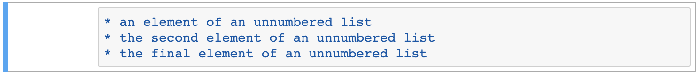

# Markdown cells / Celdas de markdown
_____

***Watch this video from 9:51 to 19:07 / Mira este video de 9:51 a 19:07***  
Para español, haga click en configuración, seleccione "español" debajo de los subtítulos. Traducción por Dr. Alejandra Rougon (UNAM ENES León, México)

<iframe width="560" height="315" src="https://www.youtube.com/embed/FrDYpLVuTkQ?si=tS2gcOhD_OsRtTGe&amp;start=591" title="YouTube video player" frameborder="0" allow="accelerometer; autoplay; clipboard-write; encrypted-media; gyroscope; picture-in-picture; web-share" referrerpolicy="strict-origin-when-cross-origin" allowfullscreen></iframe>

=== "English :flag_us:" 

    Let's learn about the other type of cell which is markdown. We can convert between coding and markdown cells by pressing "y" or "m". Markdown is a type of code but it's a type of code that gives you back a very nicely formatted text when you execute a cell. So let's say we wanted to create a beautiful type of heading we can use. When it's a markdown cell, a hashtag `#` will be a heading whereas in a coding cell a hashtag is for comments and will be ignored by Python. So it matters if you have a markdown or a coding cell.  

    One hashtag will give you a very large heading, two hashtags will give you a smaller one, three hashtags will give you an even smaller heading. And then four hashtags will give you an even smaller heading. So you can choose the the heading style that you want.

    

    You can use underscores, for example, to create a dividing line using markdown. I hope you can see, that that's a very faint dividing line. 

    

    You can write a lot of text and you can use italics and bold using asterisks. One asterisk will make your text italic. So we put an asterisk and we put the asterisks before and after the text that we want to be italicized. And then when you hit shift + enter then the text will be italics. You can also use an underscore to create italics. Two asterisks or two underscores will be bold. You can put two spaces and enter and you'll get a new line. And then you can put three asterisks or underscores, which will be italic and bold. You can execute those cells and that's how you get italic, bold, and bold and italic.

    

    You can also make lists. To make a list, it can be a numbered list, and you can just do "1", ".", space ("1. ") and just start creating the elements. And then you can do two dot space ("2. "), this will be the second, and three dot space ("3. "), the third. And you can use two spaces and a asterisk ("  \*") to create an unmarked sub heading. So if we press shift + enter you can see we have a numbered list and we even have a subheading. 

    

    You can even create an unnumbered list just by using the asterisk straight. Asterisks space ("* "), first; asterisk space ("* "), second; and asterisk space ("* "), third element. So that's how you get an unordered list.

    

    Importantly you can create links as well. To create a link you can say "for the link, click here" and you use the square brackets ("[ ]") for the text to hyperlink. So click "[here]" and we can say `https://google.com` in parentheses ("(  )") and you can see it shows up as red. So if we shift + enter that and now we click there, we will be at google. So that's how you create a link.

    

    So that's just the basics: that's how you use coding cells, that's how you use markdown. Be sure to give your notebook a name. You can always save wherever you are and create a checkpoint by just clicking on the save icon. You can always download your notebook if you've completed an assignment. You want to download it and send it to your instructor now: you go to "File", "Download as" and we're always working with ipython notebooks and they have this very long extension: it's ".ipynb" for i python notebook. "i", "p", "y", "n", "b" and you just go to "File", "Download as", your notebook and it should go to your Downloads folder.

    

    There'll be several notebooks that you'll have as assignments and that you'll need to upload into Jupyter to go over them as a lesson and review them. You can just click the upload button here and you can select the file, an ipython notebook (.ipynb) that you want to upload.  

    

    I hope now that you can see some of the really positive things that come out of using a Jupyter notebook. When you have these lessons, you can double click on the cells themselves and you can see the all the code that goes behind it: you can see all the markdown that goes into the formatting of all of the text. You will have cells that you can put your answers into for these lessons and there will also be embedded youtube videos that will go over these lessons. 

    You'll notice that these videos are actually made using Jupyter notebooks too. And these videos are meant for you to follow along and go at your own pace and if you ever need to go back and review something, pause. You can take all the time you need to review the material. That's the point of having these youtube video tutorials in the notebook. So that is some of the basics of how to download Anaconda, how to load and get Jupyter started, the very basics of using Jupyter notebooks, of creating coding and markdown cells, and how to upload and save your Jupyter notebooks.

=== "Español :flag_mx:"

    Aprendamos sobre el otro tipo de celda, que es markdown. Podemos convertir entre celdas de código y markdown presionando "y" o "m". Markdown es un tipo de código, pero es un tipo de código que te devuelve un texto muy bien formateado cuando ejecutas una celda. Entonces, digamos que queremos crear un bonito tipo de encabezado que podamos usar. Cuando se trata de una celda de markdown, un hashtag `#` será un encabezado, mientras que en una celda de código un hashtag se usa para comentarios y Python lo ignorará. Por lo tanto, es importante saber si tienes una celda de markdown o de código.

    Un hashtag te dará un encabezado muy grande, dos hashtags te darán uno más pequeño, tres hashtags te darán un título aún más pequeño. Y luego, cuatrohashtags te darán un título aún más pequeño. Entonces puedes elegir el estilo de título que desees.

    

    Puede utilizar guiones bajos "\_", por ejemplo, para crear una línea divisoria usando markdown. Espero que puedas ver que esa es una línea divisoria muy tenue.

    

    Puedes escribir mucho texto y puedes usar cursiva y negrita usando asteriscos. Un asterisco "\*" lo pondrá en cursiva. Entonces ponemos un asterisco antes y después del texto que queremos que esté en cursiva. Y luego, cuando tu presiones shift + enter, entonces el texto estará en cursiva. También puedes utilizar un guión bajo "\_" para crear cursiva, y creamos esto con markdown, y usando guiones bajos obtenemos eso también. Dos asteriscos "\*\*" o dos guiones bajos "\_\_" estarán en negrita. Entonces podemos usar dos y esto será negrita. Puedes poner dos espacios e ingresar y obtendrás una nueva línea. Recuerda que también podemos usar guiones bajos. Dos de  ellos te darán negrita. Y luego incluso puedes hacer tres asteriscos. Entonces tres asteriscos serán cursiva y negrita. O tres guiones bajos. Esto también estará en cursiva y negrita, con tres guiones bajos. Y puedes ejecutar estas celdas y así es como se pone en negrita o negrita y cursiva. 

    

    También puedes hacer listas. Entonces vamos a crear una lista. Y presionas enter. Para hacer una lista, puede ser una lista numerada y puede simplemente poner "1", ".", espacio ("1.") y simplemente comienza a crear los elementos. Este será el primer elemento. Y luego puedes hacer 2 punto espacio ("2. "), este será el segundo, y tres punto espacio ("3."), el tercero. Y puedes utilizar dos espacios y un asterisco ("  \*") para crear un subtítulo sin marcar. Entonces, si presionamos shift + enter, puedes ver que tenemos una lista numerada e incluso tenemos un subtítulo. 

    

    Incluso puedes crear una lista sin numerar con solo usar el asterisco. Asterisco espacio ("* "), primero; asterisco espacio("* "), segundo; y asterisco espacio ("* "), tercer elemento. Así es como obtienes una lista sin numeración.

    

    Y puedes crear enlaces también. Entonces, para crear un enlace, puedes decir "for the link, click here" y puedes poner el texto que quieras que esté hipervinculado dentro de los corchetes ("[ ]"). Entonces haz clic "[aquí]" y podemos decir `http://google.com` entre paréntesis ("( )") y puedes ver que se muestra en rojo. Entonces, si presionamos shift+ enter y hacemos clic ahí, estaremos en google. Así es como creas un enlace. 

    

    Así que eso es solo lo básico: así es como se usan las celdas de código y así es como se usa markdown. Asegúrate de darle un nombre a tu notebook. Siempre puedes guardar donde quiera que estés y crear un punto de control con solo hacer clic en el icono de guardar. Siempre puedes descargar tu notebook si has completado una tarea. Quieres descargarlo y enviarlo a tu instructor ahora: Ve a "File", "Download as" y siempre estamos trabajando con notebooks de ipython y tienen esta extensión muy larga que es ".ipynb" para I PYthon NoteBook. "i", "p", "y", "n", "b" y simplemente ve a "Archivo", "Download as", tu notebook y debería irse a tu carpeta de Descargas. 

    

    Habrá varios notebooks que tendrás como tareas y que deberás cargar en Jupyter para que realices los ejercicios y repasarlos como una lección. Puedes simplemente hacer clic en "upload" aquí y puedes seleccionar el archivo, un cuaderno ipython (.ipynb) que desea cargar.

    

    Y espero que ahora puedas ver algunas de las cosas realmente positivas que surgen al usar un Jupyter notebook. Cuando tengas estas lecciones, puedes hacer doble clic en las celdas mismas y puedes ver todo el código que hay detrás de él, aquí puedes ver todo el markdown que entra para dar formato de todo el texto. Tendrás celdas en las que podrás poner tus respuestas para estas lecciones y también habrá videos de youtube incrustados que repasarán estas lecciones. 

    Notan que estos videos en realidad también se hicieron con cuadernos de Jupyter. Y estos videos están pensados para que los sigas y vayas a tu propio ritmo. Y si alguna vez necesitas volver a revisar algo, haz una pausa. Puedes llevarte todo el tiempo que necesites para revisar el material. Ese es el punto de tener estos videos tutoriales de youtube en el notebook. Así que esos son algunos de los conceptos básicos de cómo descargar Anaconda, cómo cargar y comenzar a usar Jupyter, los conceptos básicos del uso de Jupyter notebooks, de la creación de celdas de código y markdown, y cómo cargar y guardar tusJupyter notebooks.
