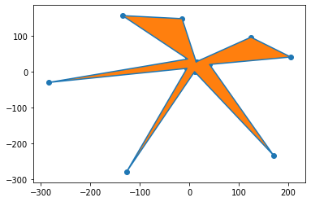
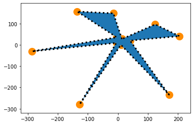

# 2.2 Shape, Size, and Color

## How to manipulate shape, size, and color in plots
___

***Watch this video from 8:12 to 16:55***


```python
# To load the video, execute this cell by pressing shift + enter

from IPython.display import YouTubeVideo
from datetime import timedelta
start=int(timedelta(hours=0, minutes=8, seconds=12).total_seconds())
end=int(timedelta(hours=0, minutes=16, seconds=55).total_seconds())

YouTubeVideo("PJ1dvAgOAj0",start=start,end=end,width=640,height=360)
```


<iframe
    width="640"
    height="360"
    src="https://www.youtube.com/embed/PJ1dvAgOAj0?start=492&end=1015"
    frameborder="0"
    allowfullscreen
></iframe>


***The following is a transcript of the video.***

> 💡 ***Remember:*** You must first import `matplotlib` in order to make plots. Below are the data that we will be working with in this lesson that are used in the video. These are lists of `x` and `y` coordinate values for 15 different *Vitis* and *Ampelopsis* species. Execute the cell below to read in the data to complete this lesson.


```python
# Execute this cell to import matplotlib

import matplotlib.pyplot as plt
%matplotlib inline
```


```python
# This cell contains lists of x values and y values for 
# leaf outlines of 15 Vitis and Ampelopsis species.
# Each list has the abbreviated first initial of the genus and species epithet

# Ampelopsis "acoutifolia" (actually aconitifolia)

# NOTE: There is a transcription error for this species, which is actually
# Ampelopsis aconitifolia (it is not A. "acoutifolia")
# The mistake is propagated in the videos, narration, text, and notebooks
# but it does not affect the lesson at hand for plotting in matplotlib
Aaco_x = [13.81197507,-14.58128237,-135.3576208,-3.48017966,-285.0289837,-4.874351136,-126.9904669,10.54932685,170.4482865,40.82555888,205.158889,124.6343366,13.81197507]
Aaco_y = [27.83951365,148.6870909,157.2273013,35.73510131,-30.02915903,9.54075375,-280.2095191,0.200400495,-234.1044141,20.41991159,41.33121759,96.75084391,27.83951365]

# Ampelopsis brevipedunculata
# NOTE: This species is now referred to as A. glandulosa var. brevipedunculata
Abre_x = [40.00325135,-81.37047548,-186.835592,-139.3272085,-287.5337006,-89.61277053,-134.9263008,47.43458846,144.6301719,163.5438321,225.9684307,204.719859,40.00325135]
Abre_y = [96.8926433,203.3273536,134.0172438,99.7070006,-81.35389923,-17.90701212,-335.624547,-80.02986776,-262.0385648,-27.31979918,-42.24377429,82.08218538,96.8926433]

# Ampelopsis cordata
Acor_x = [41.26484889,-99.68651819,-203.5550411,-181.4080156,-226.4063517,-174.1104713,-142.2197176,81.25359041,113.9079805,205.9930561,230.8000389,226.6914467,41.26484889]
Acor_y = [105.1580727,209.8514829,131.8410788,111.9833751,-70.79184424,-60.25829908,-326.5994491,-170.6003249,-223.0042176,-44.58524791,-45.80679706,71.64004113,105.1580727]

# Vitis acerifolia
Vace_x = [47.55748802,-102.1666218,-218.3415108,-183.5085694,-234.8755094,-152.1581487,-113.8943819,53.48770667,84.83899263,206.557697,240.589609,243.5717264,47.55748802]
Vace_y = [111.9982016,241.5287104,125.6905949,110.350904,-108.1932176,-74.67866027,-283.2678229,-161.1592736,-243.1116283,-54.52616737,-68.953011,95.74558526,111.9982016]

# Vitis aestivalis
Vaes_x = [34.13897003,-59.06591289,-192.0336456,-169.5476603,-261.8813454,-154.4511279,-132.6031657,56.04516606,119.9789735,205.0834004,246.928663,209.2801298,34.13897003]
Vaes_y = [80.26320349,227.2107718,155.0919347,123.2629647,-86.47992069,-70.12024178,-317.80585,-156.8388147,-247.9415158,-31.73423173,-28.37195726,120.2692722,80.26320349]

# Vitis amurensis
Vamu_x = [36.94310365,-63.29959989,-190.35653,-180.9243738,-255.6224889,-172.8141253,-123.8350652,60.05314983,113.598307,218.8144919,238.6851057,210.9383524,36.94310365]
Vamu_y = [87.06305005,230.9299013,148.431809,128.4087423,-88.67075769,-84.47396366,-298.5959647,-181.4317592,-241.2343437,-37.53203788,-30.63962885,115.7064075,87.06305005]

# Vitis cinerea
Vcin_x = [41.13786595,-78.14668163,-195.0747469,-185.81005,-238.1427795,-181.5728492,-127.6203541,65.24059352,103.8414516,214.1320626,233.1457326,222.7549456,41.13786595]
Vcin_y = [98.40296936,233.6652514,136.6641628,117.9719613,-86.41814245,-86.14771041,-310.2979998,-190.9232443,-230.5027809,-50.27050419,-42.94757891,107.8271097,98.40296936]

# Vitis coignetiae
Vcoi_x = [36.29348151,-51.46279315,-183.6256382,-176.7604659,-253.3454527,-191.8067468,-123.413666,66.11061054,111.4950714,215.7579824,236.7136632,197.5512918,36.29348151]
Vcoi_y = [86.42303732,222.7808161,150.0993737,127.4697835,-85.23634837,-93.3122815,-301.819185,-203.7840759,-239.8063423,-35.30522815,-25.15349577,121.1295308,86.42303732]

# Vitis labrusca
Vlab_x = [33.83997254,-63.35703212,-191.4861127,-184.3259869,-257.3706479,-179.056825,-124.0669143,68.23202857,123.213115,222.8908464,243.056641,205.2845683,33.83997254]
Vlab_y = [81.34077013,222.8158575,153.7885633,132.4995037,-80.2253417,-80.67586345,-296.8245229,-185.0516494,-238.8655248,-38.2316427,-29.21879919,111.424232,81.34077013]

# Vitis palmata
Vpal_x = [31.97986731,-68.77672824,-189.26295,-164.4563595,-260.2149738,-149.3150935,-131.5419837,65.86738801,127.3624336,202.6655429,240.0477009,219.0385121,31.97986731]
Vpal_y = [78.75737572,232.9714762,149.7873103,124.8439354,-71.09770423,-56.52814058,-329.0863141,-149.308084,-231.1263997,-33.22358667,-33.0517181,114.3110289,78.75737572]

# Vitis piasezkii
Vpia_x = [18.70342336,-28.68239983,-133.7834969,-32.76128224,-305.3467215,-7.429223951,-146.2207875,21.81934547,163.1265031,65.21695943,203.4902238,139.6214571,18.70342336]
Vpia_y = [41.05946323,160.3488167,157.9775135,64.93177072,-59.68750782,18.85909594,-362.1788431,7.556816875,-253.8796355,21.33965973,17.69878265,93.72614181,41.05946323]

# Vitis riparia
Vrip_x = [44.65674776,-85.47236587,-205.1031097,-174.088415,-239.9704675,-161.1277029,-125.4900046,58.08609552,89.2307808,204.9127104,236.0709257,229.8098573,44.65674776]
Vrip_y = [106.5948187,235.8791214,130.341464,116.8318515,-110.5506636,-76.73562488,-300.1092173,-169.0146383,-247.0956802,-42.2253331,-54.23469169,103.9732427,106.5948187]

# Vitis rupestris
Vrup_x = [51.29642881,-132.9650549,-227.6059714,-201.31783,-207.965755,-149.2265432,-98.64097334,48.33648281,75.91437502,208.7784453,237.4842778,263.3479415,51.29642881]
Vrup_y = [123.7557878,233.5830974,109.6847731,95.43848563,-95.82512925,-80.06286127,-236.7411071,-163.7331427,-213.2925544,-77.04510916,-86.40789274,69.86940263,123.7557878]

# Vitis thunbergii
Vthu_x = [22.61260382,-3.204532702,-150.3627277,-79.39836351,-271.8885204,-70.74704134,-168.6002498,36.68300146,172.978549,116.9174032,227.8346055,148.3453958,22.61260382]
Vthu_y = [50.82336098,194.3865012,181.2536906,86.8671412,-57.33457233,-23.85610668,-334.279317,-67.36542042,-234.1205595,7.151772223,28.16801823,138.9705667,50.82336098]

# Vitis vulpina
Vvul_x = [39.44771371,-83.62933643,-194.2000993,-175.9638941,-227.8323987,-180.8587446,-135.986247,71.94543538,99.8983207,207.0950158,231.7808734,222.7645396,39.44771371]
Vvul_y = [96.44934373,230.0148139,136.3702366,119.8017341,-83.09830126,-75.38247957,-332.9188424,-184.4324688,-222.8532423,-41.89574792,-44.70218529,101.9138055,96.44934373]

# Average grape leaf
avg_x = [35.60510804,-67.88314703,-186.9749654,-149.5049396,-254.2293735,-135.3520852,-130.4632741,54.4100207,120.7064692,180.696724,232.2550642,204.8782463,35.60510804]
avg_y = [84.95317026,215.7238025,143.85314,106.742536,-80.06000256,-57.00477464,-309.8290405,-137.6340316,-237.7960327,-31.10365842,-30.0828468,103.1501279,84.95317026] 
```

You've seen the very basic functions of `plot()`, `scatter()`, and `fill()`. But you can do a lot more than that. So let's see how we can manipulate the shape, size, and color of elements in these plots.

Remember hashtags, as you've been seeing throughout these notebooks. This is a way for Python to ignore any code or text that you put after a hashtag. Here I've hashed out everything except the very basic plot that you just saw in the previous lesson notebook. This is where we ended before and here in these hashes I'm showing you all these different arguments you can use that we will explore. Things like color, line style, line widths, size, and alpha (which is how transparent something is), aspect ratios, titles, x-axis labels, and even turning the axis labels on and off. This is the main point of this video tutorial and the activity associated with this lesson, which is to explore all of these parameters and all the choices you have so that you have the power to create the graphs and visualizations that you want.


```python
# The plot from the previous lesson notebook
# And comments of the different arguments
# we will explore to customize the plot as we like

plt.plot(Aaco_x, Aaco_y) # color="k", linestyle=":", linewidth=3
plt.scatter(Aaco_x, Aaco_y) # color="darkorange", s=200
plt.fill(Aaco_x, Aaco_y) # color=""#42A84F", alpha=0.5

# Note in video plt.axes.set_aspect() is used
# But this creates a warning, so gca() (Get Current Axes) is used instead
# plt.gca().set_aspect("equal", "datalim") # box or datalim, box exactly equal, but datalim as much as needed

# plt.title("Ampelopsis acoutifolia", fontsize=18, style="italic", fontweight="bold")
# plt.xlabel("x values")
# plt.ylabel("y values")
# plt.axis("off")
```


    

    


One by one we'll explore the different ways you can manipulate these graphs.

For example, the plot function. We can change the color. There's a shorthand in Python for the colors. You can just use letters sometimes to denote a color. For example "k" refers to black. So we can put color = "k". Notice that the the lines are blue right now but if we say "k" for black, now they are black.

It's just a simple line at this moment but we could say line style equals colon and instead of a straight line now we could get a different style. For example, a dotted line. Let's say we want a wider line. We could say line width equals three, something more than one, which it is right now, and you can see we get a much thicker line.


```python
# The plot from the previous lesson notebook
# And comments of the different arguments
# we will explore to customize the plot as we like

plt.plot(Aaco_x, Aaco_y, color="k", linestyle=":", linewidth=3)
plt.scatter(Aaco_x, Aaco_y) # color="darkorange", s=200
plt.fill(Aaco_x, Aaco_y) # color=""#42A84F", alpha=0.5

# Note in video plt.axes.set_aspect() is used
# But this creates a warning, so gca() (Get Current Axes) is used instead
# plt.gca().set_aspect("equal", "datalim") # box or datalim, box exactly equal, but datalim as much as needed

# plt.title("Ampelopsis acoutifolia", fontsize=18, style="italic", fontweight="bold")
# plt.xlabel("x values")
# plt.ylabel("y values")
# plt.axis("off")
```


    

    


What about the scatter? Let's say we want the point colors to be dark orange. I'm going to show you a link after this where you can look up all these colors and how to refer to them by name. If we say color "darkorange" the points become dark orange. "s" refers to size. Let's make these points really big, let's say s=80, and now you can see these points are really big. We could go to 800. Let's say something more like s=200. We have some big points now.


```python
# The plot from the previous lesson notebook
# And comments of the different arguments
# we will explore to customize the plot as we like

plt.plot(Aaco_x, Aaco_y, color="k", linestyle=":", linewidth=3)
plt.scatter(Aaco_x, Aaco_y, color="darkorange", s=200)
plt.fill(Aaco_x, Aaco_y) # color=""#42A84F", alpha=0.5

# Note in video plt.axes.set_aspect() is used
# But this creates a warning, so gca() (Get Current Axes) is used instead
# plt.gca().set_aspect("equal", "datalim") # box or datalim, box exactly equal, but datalim as much as needed

# plt.title("Ampelopsis acoutifolia", fontsize=18, style="italic", fontweight="bold")
# plt.xlabel("x values")
# plt.ylabel("y values")
# plt.axis("off")
```


    

    


For the fill of the polygon, another color scheme we can use is called hex codes. Hex codes are a series of six characters and they have a hashtag before them and they have quotations because they're a string. Each is a specific color. Here we are using a green color. This is a way to encode a large number of colors and again I'll show you a link where you can find your own hex codes. This gives you a lot of power in selecting the exact color that you want.

Next we have something called alpha. Alpha is transparency. When alpha is set to 1, which is default, the object is not transparent. But if we set it to 0.5, then it's halfway transparent. Because we made the polygon half transparent, you can see that the points are showing through partly.


```python
# The plot from the previous lesson notebook
# And comments of the different arguments
# we will explore to customize the plot as we like

plt.plot(Aaco_x, Aaco_y, color="k", linestyle=":", linewidth=3)
plt.scatter(Aaco_x, Aaco_y, color="darkorange", s=200)
plt.fill(Aaco_x, Aaco_y, color="#42A84F", alpha=0.5)

# Note in video plt.axes.set_aspect() is used
# But this creates a warning, so gca() (Get Current Axes) is used instead
# plt.gca().set_aspect("equal", "datalim") # box or datalim, box exactly equal, but datalim as much as needed

# plt.title("Ampelopsis acoutifolia", fontsize=18, style="italic", fontweight="bold")
# plt.xlabel("x values")
# plt.ylabel("y values")
# plt.axis("off")
```


    

    


Notice the the scale of these axes is not consistent. It creates a warped leaf. There's a way to set aspect ratio for these axes, `set_aspect`. We want them to be equal. If we execute this, now you can see that we have a box and that the spacing between the axes is proportional. There's two different options. You have "box" or "datalim". "Box" forces the plot to be a a box, but "datalim" will create equal axes, but it will allow the axes to go as as long as they need to and to have all the data within the plot. So it's not forcing it to be a box anymore.  

We can put a title. The function for this is `plt.title()`. The species is *Ampelopsis aconitifolia* and you can change your title and format it the ways that you want. You can choose a font size and you can choose a style. Let's make it italic, because that's usually how people format the names of species. You can select a font weight to make something bold, for example. If we use these parameters for the arguments of `plt.title()` you can see we get a bold, italic title. We can give names to our x and y axes. Let's just call them "x values" and "y values" and you can see that we have x and y values for our two axes now that are named.

There's more functions! For example, `plt.axis()` can be either on, where you have all the values displayed, or it could be off. Maybe if we're drawing shapes like this, we'd rather not look at all the numbers on the axis, so we can turn the axes off.


```python
# see link in notebook for different parameters, etc.
# see link for hexcodes

plt.plot(Aaco_x, Aaco_y, color="k", linestyle=":", linewidth=3) # color="k", linestyle=":", linewidth=3
plt.scatter(Aaco_x, Aaco_y, color="darkorange", s=200) # color="darkorange", s=200
plt.fill(Aaco_x, Aaco_y, color="#42A84F", alpha=0.5) # color=""#42A84F", alpha=0.5

# Note in video plt.axes.set_aspect() is used
# But this creates a warning, so gca() (Get Current Axes) is used instead
plt.gca().set_aspect("equal", "datalim") # box or datalim, box exactly equal, but datalim as much as needed

plt.title("Ampelopsis aconitifolia", fontsize=18, style="italic", fontweight="bold")
plt.xlabel("x values")
plt.ylabel("y values")
plt.axis("off")
```


    

    


The whole point of this particular cell was to show you that there are many arguments and choices to make, and within those arguments, of which color, shape, or size of the different plot elements that you would like to use. The amount of choices you can make for a matplotlib graph are tremendous and so I really recommend that you spend time exploring exactly what you can change on various matplotlib plots. This is one of the more creative aspects of coding, so really treat it like exploring. There's no wrong answers when it comes to visualization.

For example, these are all [the named colors in matplotlib](https://matplotlib.org/stable/gallery/color/named_colors.html). You can refer to these by name.  

I also mentioned hex codes. There's numerous [hex code generators](https://htmlcolorcodes.com/) that you can just google and look up. For example, within this color scheme, you can see the hashtag and this is the six character hex code. You can change the hue, for example, and then change its lightness. You can see the power in having the ability to choose almost any color that you want using these hex codes.

One way to explore all the different ways you can do things in matplotlib is to look at sample plots. There are [galleries of different types of plots](https://matplotlib.org/stable/tutorials/introductory/sample_plots.html#sphx-glr-tutorials-introductory-sample-plots-py). A great way to learn matplotlib is if you have data and you have a particular type of visualization in mind to go to this gallery and try to find the plots that you would like to make. You can look at the examples and try to figure out yourself all the things that you can do to create the plot that you want and all the parameters and different choices that you have to make for that visualization.  
