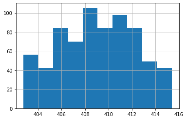

# 4.3 Descriptive Statistics

## How to perform descriptive statistics using `pandas` (`.min`, `.max`, `.std`, `.value_count`)
____

***Watch this video from 6:01 to 8:06***


```python
# To load the video, execute this cell by pressing shift + enter

from IPython.display import YouTubeVideo
from datetime import timedelta
start=int(timedelta(hours=0, minutes=6, seconds=1).total_seconds())
end=int(timedelta(hours=0, minutes=8, seconds=6).total_seconds())

YouTubeVideo("jEQRU55x0e4",start=start,end=end,width=640,height=360)
```


<iframe
    width="640"
    height="360"
    src="https://www.youtube.com/embed/jEQRU55x0e4?start=361&end=486"
    frameborder="0"
    allowfullscreen
></iframe>


> 💡 ***Remember:*** Import `pandas` and read in the dataset below to complete this lesson.


```python
# Import pandas

import pandas as pd
```


```python
# Download the dataset from the
# Jupyter Book to read in locally or 
# read in from GitHub, below:

data = pd.read_csv('https://raw.githubusercontent.com/DanChitwood/PlantsAndPython/master/co2_mlo_weekly.csv')
```

***The following is a transcript of the video.***

Next, let's look at how to perform some descriptive statistics in pandas, things like finding minimums, maximums, standard deviations, how many there are of each factor level.

This is incredibly simple. You just saw that we can refer to a specific column using a string. Let's say we want CO2 parts per million, but we want the minimum value of CO2 parts per million for that column. So we refer to the specific column and all we do is we add dot min as a function. And we get back that the minimum is 402.76.


```python
# There are a series of functions to perform simple statistics on columns

# .min()

data['CO2ppm'].min()
```


    402.76


If we want the max, we do the same thing: dot max, we get 415.39.


```python
# .max()

data['CO2ppm'].max()
```


    415.39


If we want the mean, we just take dot mean we get 408, somewhere in between them.


```python
# .mean()

data['CO2ppm'].mean()
```


    408.9770588235291


And if we want the median, we use the dot median function and we also get something somewhere in between the minimum and the maximum. 


```python
# .median()

data['CO2ppm'].median()
```


    409.01


There's a lot of these functions and you can quickly look these up. They're very useful. You can use unique to give you the levels of a column, what types of different things are in that column. So for example, if we look at the specific column of month, the different levels 
of that column are the months of the year.  


```python
# .unique() gives the levels of a column, the different values

data['month'].unique()
```


    array(['aug', 'sep', 'oct', 'nov', 'dec', 'jan', 'feb', 'mar', 'apr',
           'may', 'jun', 'jul'], dtype=object)


You can also get how many things there are of each one. This is called value counts. Again for month, maybe we want to get the value counts and you can see for each month it's going to give us how much data points there are for each month.


```python
# .value_counts() returns how many data points there are for each level

data['month'].value_counts()
```


    jan    62
    may    62
    dec    62
    mar    62
    oct    62
    sep    60
    nov    60
    apr    60
    jun    60
    jul    58
    feb    56
    aug    50
    Name: month, dtype: int64


There's a lot of really useful functions. Some of them even do plotting. For example, `.hist()`, will give you a histogram (a plot showing the count of samples over a range of values).


```python
# .hist() will return a histogram

data['CO2ppm'].hist(bins=10) # have to shift-enter twice
```


    

    


So that was how by very simply referring to the names of columns and then using functions and pandas you can get very basic statistical parameters back.
