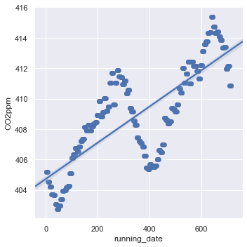
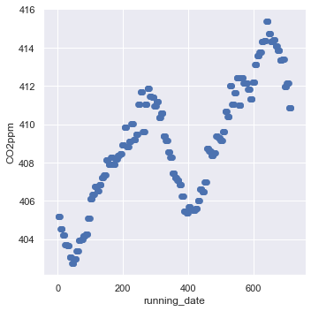
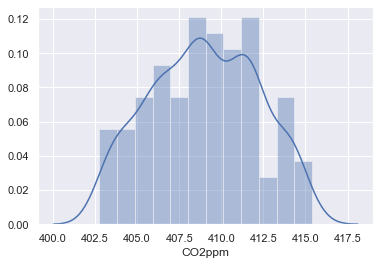
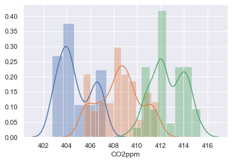

# 4.6 Seaborn

## Plotting with `seaborn` (specialized plotting for statistics)
____

***Watch this video from 16:25 to 2:35***


```python
# To load the video, execute this cell by pressing shift + enter

from IPython.display import YouTubeVideo
from datetime import timedelta
start=int(timedelta(hours=0, minutes=16, seconds=25).total_seconds())
end=int(timedelta(hours=0, minutes=2, seconds=35).total_seconds())

YouTubeVideo("jEQRU55x0e4",start=start,end=end,width=640,height=360)
```


<iframe
    width="640"
    height="360"
    src="https://www.youtube.com/embed/jEQRU55x0e4?start=985&end=155"
    frameborder="0"
    allowfullscreen
></iframe>


***The following is a transcript of the video.***

> 💡 ***Remember:*** Import `pandas` and read in the dataset below to complete this lesson.


```python
# Import pandas

import pandas as pd
```


```python
# Download the dataset from the
# Jupyter Book to read in locally or 
# read in from GitHub, below:

data = pd.read_csv('https://raw.githubusercontent.com/DanChitwood/PlantsAndPython/master/co2_mlo_weekly.csv')
```

Next let's look at seaborn, which is an alternative way than matplotlib to look at your data. And as you'll see seaborn is much more specialized for plotting statistical data than matplotlib is.  

So you've already seen how to use matplotlib before. But for seaborn it works much better with pandas. As you'll see it works much better with dataframes and it can do very sophisticated statistical functions and it's also a little more aesthetic in producing good looking figures quickly than matplotlib is. So we import seaborn as sns. Also seaborn has this thing called styles and you can use that using sns.set and you can look up the different styles. It's an easy way just to change the background, the grid lines, and axis ticks in your plots for different uses. So we hit shift + enter to import seaborn


```python
# We've seen how matplotlib can be used to plot and visualize data

import matplotlib.pyplot as plt
%matplotlib inline

# But there is another package called seaborn as well
# seaborn is better than matplotlib with respect to
# playing nice with pandas and dataframes
# and for specific statistical functions

import seaborn as sns
sns.set() # sets different styles, for figures/presentation/poster

```

It is helpful to look through the seaborn gallery.
Find the plot, function, or style that you need and look through the example.

Gallery: [https://seaborn.pydata.org/examples/index.html](https://seaborn.pydata.org/examples/index.html)
    
Explore seaborn styles here: [http://seaborn.pydata.org/tutorial/aesthetics.html](http://seaborn.pydata.org/tutorial/aesthetics.html)

Oe of the most common seaborn plot functions is called `lmplot()`. We call it by `sns.lmplot()` and this is how easy seaborn is to use. Just by referring to your dataframe, saying data equals what your dataframe is (in our case it's `data`) as soon as you tell seaborn what the dataframe is you can refer to your data by column name.

So let's say we want a linear model plot using lmplot, where the x-axis is the column running date and the y-axis is CO2 parts per million and we say that our dataframe is data and really quickly seaborn will come up with this beautiful plot. You can see the data here. You see this cyclical cycle of CO2 parts per million. This happens every year, it has to do with the seasonal variation of the earth, and this is literally because the the plants are dying in the winter in the northern hemisphere and vice versa in the southern hemisphere and the amount of carbon dioxide that they're taking in and releasing and decay and other things that contribute to CO2 create these these really striking cycles. This data, if you remember, is from 2017, 2018, and 2019 and even though it's cycling up and down the overall trend is to go up. So the linear plot function refers to linear modeling and so it will plot your data as a scatter plot as you can see with these points. These are the CO2 values as we specified for our y-axis, but it will automatically try to to fit a line to your data. A line is not appropriate for the cyclical nature of this data as you can see. You would have to use something like a sine function for that but you can see because the CO2 level is increasing 
overall that the linear function is appropriate for looking at that overall increase.


```python
# lm refers to "linear model"
# The sns.lmplot function will fit a line to your data

sns.lmplot(x='running_date', y='CO2ppm', data=data)
```


    

    


Let's say though that we just want the scatter plot, we don't want a line in it. So you can just run the same line of code with `lmplot()` but this fit_reg argument is asking "should seaborn try to fit a linear model?" and you can say `False`. So if you say `False` then you just get the scatter plot of CO2 parts per million back.


```python
# But maybe you don't want the line
# Set fit_reg to False and you get just the scatterplot!

sns.lmplot(x='running_date', y='CO2ppm', data=data, fit_reg=False)
```


    

    


Another really great function in seaborn is `distplot`, this is like a density or a histogram plot and you just say which column you  want to create the density histogram plot of and we want to look at CO2 parts per million and you'll get a beautiful histogram, but importantly you're getting this density estimate of the distribution of the data as well.


```python
# Use sns.distplot() to plot a density plot/histogram

sns.distplot(data['CO2ppm'])
```


    

    


Let's say that we want to be more specific. We want to look at the different densities of the years 2017, 2018, and 2019. So remember we already converted year into a categorical variable, but we can create masks. So we're going to say we want the CO2 data, so we refer to the CO2 column as a string in the brackets and then we put a second set of brackets with our mask. We say we want all the data for CO2 for the year 2017. So we say where year, where it's `True` that year is equal to 2017, and we create an object to store that data and we call it `year2017`. We do the same for the year 2018 and we do the same for the year 2019. So now we have our years separated out.  


```python
# What if we want to separate our data out by categories?
# For example, by year?

# We make masks!

year2017 = data['CO2ppm'][data['year']==2017]
year2018 = data['CO2ppm'][data['year']==2018]
year2019 = data['CO2ppm'][data['year']==2019]
```

It's just like matplotlib: you can just keep on calling the plotting functions one after the other and they will just paste the data on top of the plot that you're making. So we want a density plot of the year 2017 CO2 values, a density plot of the year 2018, and the density plot of the year 2019, and you can see whereas we had them all combined before now it's creating these different density plots and we can see there there's clear differences in the CO2 levels between years and that they are increasing.


```python
# Just like matplotlib, you can keep calling a funciton 
# to keep plotting data categories onto the same plot

sns.distplot(year2017, label='2017')
sns.distplot(year2018, label='2018')
sns.distplot(year2019, label='2019')
```


    

    


**So what did we learn?**

**Python learning objectives**

* How to read in a dataframe using `pandas`
* How to quickly assess dataframe properties, using `head` and `tail`
* How to select columns of a dataframe
* How to perform descriptive statistics using `pandas` (`.min`, `.max`, `.std`, `.value_counts`)
* How to mask data (a Boolean statement to fish out data that you want, square brackets after a dataframe)
* How to use `iloc` to isolate data within a dataframe (rows first, columns second, start:end, and square brackets)
* Plotting with `seaborn` (specialized plotting )

**Plant learning objectives**

* CO2 levels are increasing, which increases global temperatures
* Plants respond to increases in CO2 and temperature
* In the next activity, we'll examine the effects of global warming on crop plants
* Statistics and data visualization are powerful techniques to explore global trends

# Thank you!
