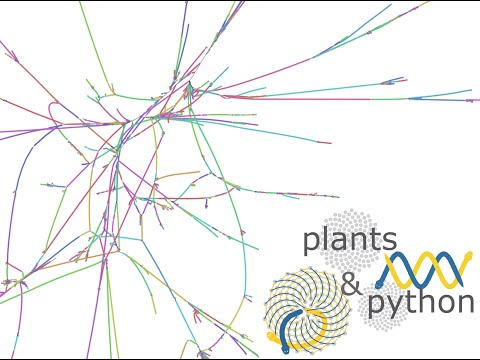

# 8.0 Introduction to plant genomics and working with sequences in Python

## Plant biology learning objectives
- What makes up the genome and how genomes vary between plant species
- The current state of plant genomics
- History and fundamentals of DNA sequencing technology
- Principles of genome assembly

## Python learning objectives
- Provide a board introduction to Biopython
- Learn how to write, manipulate, and transform sequences as strings
- Learn how to import, filter, sort, manipulate, and write sequence files as SeqRecord objects
- Learn how to compare sequences using BLAST via Biopython

## 8.1 Genome Assembly
In this lesson, we will assemble the genome from an unknown plant species, use the Python package BioPython to process the assembled sequence, and use BLAST to identify the unknown species. Assembling a genome requires significant computational resources and we can use the memory and CPU resources at the HPCC to reduce assembly time to a few minutes or a few days depending on the size of the genome and the amount of data being assembled. Like most computational tasks, there are a range of programs we can use to correct and assemble long read data, and each program has unique advantages and disadvantages. Some programs are better suited for assembling complex, polyploid, repetitive, or heterozygotic genomes but this often comes at a cost in terms of memory, CPUs, or assembly contiguity. Most genome assembly programs were developed and optimized for human or other ‘simple’ mammalian genomes, and they struggle to do a good job overcoming the complexity found in most plant genomes. Below is an introductory video on plant genomics and plant genome assembly. 


```python
from IPython.display import YouTubeVideo

YouTubeVideo("cWX6lsubdXQ",width=960,height=540)

```


<iframe
    width="960"
    height="540"
    src="https://www.youtube.com/embed/cWX6lsubdXQ"
    frameborder="0"
    allowfullscreen
></iframe>


For the in class activity, we will assembly plant genomes on HPCC using unknown raw sequence reads and leading genome assembly algorithms. We can use a powerful Python module to import, filter, manipulate, and analyze these sequences called Biopython. 

## 8.2 Intro to Biopython

Biopython is a workhorse for working with, manipulating, and analyzing molecular biology and genomic datasets using Python. 
The Biopython Project represents a set of powerful tools developed from various international groups. 

The Biopython web site (http://www.biopython.org) provides an online resource for modules, scripts, and web links for developers of Python-based software for bioinformatics use and research. Basically, the goal of Biopython is to make it as easy as possible to use Python for bioinformatics by creating high-quality, reusable modules and classes. Biopython features include parsers for various Bioinformatics file formats (BLAST, Clustalw, FASTA, Genbank,...), access to online services (NCBI, Expasy,...), interfaces to common and not-so-common programs (Clustalw, DSSP, MSMS...), a standard sequence class, various clustering modules, a KD tree data structure etc. and the associated documentation.

You will need to install Biopython if you haven't already. To do this, type the following into the Anaconda powershell prompt: <br>
`pip install Biopython` <br>
You can check the basic installation and inspect the version as follows:


```python
import Bio
print(Bio.__version__)
```


Below is a series of exercises to work with sequences using Biopython. Follow along in the cells below, and we will use these principles to import, filter, and figure out the idenity of our unknown species.


```python
from IPython.display import YouTubeVideo

YouTubeVideo("P3s5FPisa_Q",width=960,height=540)

```


<iframe
    width="960"
    height="540"
    src="https://www.youtube.com/embed/P3s5FPisa_Q"
    frameborder="0"
    allowfullscreen
></iframe>

## 8.3 Working with sequences


```python
from Bio.Seq import Seq
```


## 8.4 Reading Sequence Files
<br>


```python
from Bio import SeqIO
seq_file = SeqIO.parse("PATH_TO_YOUR_FILE", "fasta")
```


## 8.5 Running BLAST over the Internet


```python
from Bio.Blast import NCBIWWW

```

