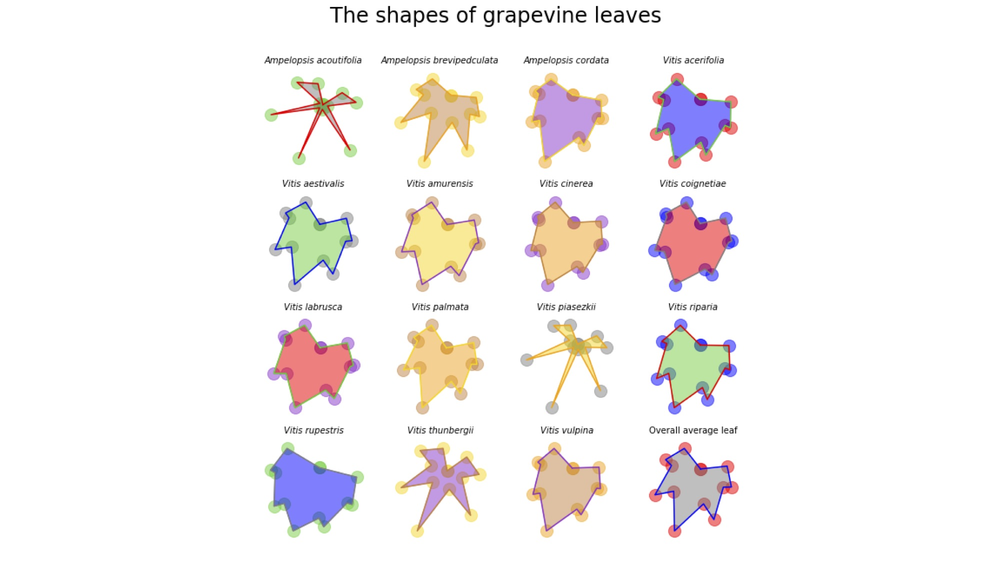
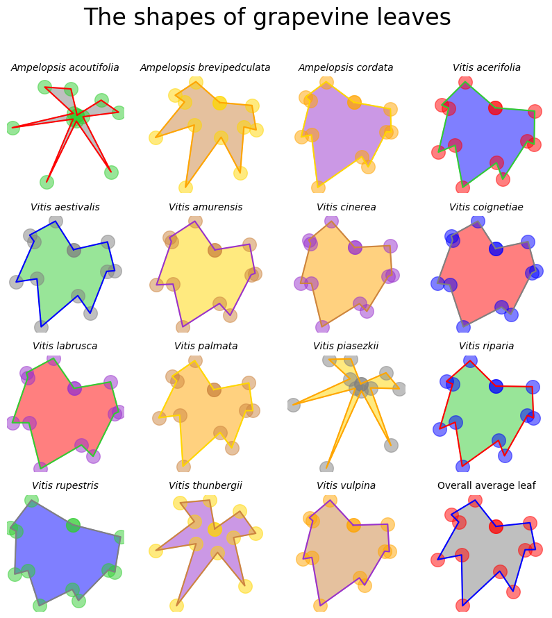
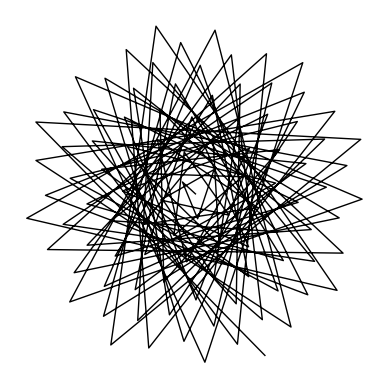
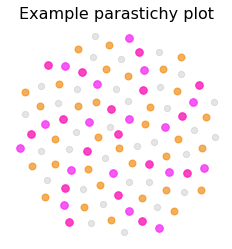
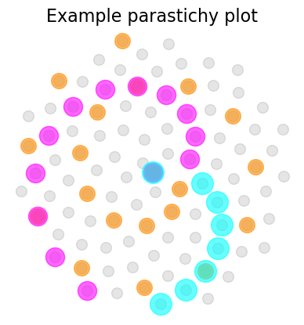

# Actividad 2: Las formas de las hojas y girasoles 🍃🌻
***Traducción por Marilyn Vásquez-Cruz y Omar Andres Gonzalez Iturbe (Langebio-Cinvestav, Irapuato, México)***

___

## La forma de los datos, la forma de las hojas 🍃: visualizando datos usando matplotlib

Las listas almacenan datos y, en la mayoría de los casos, los datos se codifican numéricamente. Las listas son una herramienta poderosa en Python para almacenar y manipular datos. Pero antes de analizar datos, debemos saber qué son, y para conocer nuestros datos, necesitamos visualizarlos. Cuando vemos algo, primero notamos su forma: su forma, contorno, estructura y geometría. Todos los datos tienen una forma y todas las formas son datos.

En este ejercicio aprenderemos a visualizar nuestros datos usando Matplotlib. Matplotlib es un módulo. Los módulos en Python son colecciones de funciones y declaraciones. Los módulos generalmente están diseñados para abordar una funcionalidad específica o un nicho de interés de una comunidad. Los módulos que encontraremos en este curso son generalistas e incluyen matplotlib, pandas y math.

Aprendimos en la lección anterior que las especies de plantas son diversas y numerosas, que ocupan los océanos, los ríos y la tierra como organismos unicelulares, organismos multicelulares grandes y elaborados, simbiontes e incluso colonias. Visualicemos algo de esta variación natural, usando nuevamente la vid como ejemplo.

El vino que bebemos se elabora principalmente a partir de las bayas de *Vitis vinifera*. Pero las vides en sí mismas son quimeras: es decir, la mayoría de las vides utilizadas para la producción de vino son una combinación quirúrgica de dos especies diferentes producidas mediante injertos. Los brotes pueden ser *V. vinifera*, pero las raíces son parientes silvestres que son resistentes a las enfermedades y están bien adaptadas para determinados tipos de suelo.

Las formas de las hojas de la vid se prestan fácilmente al análisis cuantitativo. Cada hoja de vid tiene cinco lóbulos principales: la punta de la hoja, dos lóbulos distales y dos proximales (el proximal está cerca de la base de la hoja y el distal hacia la punta). Además, hay senos distales y proximales (las hendiduras entre los lóbulos). Algunas hojas están muy disecadas (lo que significa que son muy lobuladas) y otras más completas (sin lóbulos). Debido a que estos puntos están en cada hoja de la vid, existe una correspondencia entre los puntos, lo que nos permite comparar las formas de las hojas de la vid entre sí.

En la celda siguiente hay listas de valores para "x" y "y" para las hojas promediadas de las especies *Vitis* y *Ampelopsis*, así como la hoja de la vid promediada en general. Ejecuta la celda de abajo para leer estos datos y has algunos gráficos por ti mismo, ¡a continuación!


```python
# Esta celda contiene listas de valores para "x" y "y" para
# contornos de hojas de 15 especies de Vitis y Ampelopsis.
# Cada lista tiene la primera inicial abreviada del epíteto de género y especie.

# Ampelopsis acoutifolia
Aaco_x = [13.81197507,-14.58128237,-135.3576208,-3.48017966,-285.0289837,-4.874351136,-126.9904669,10.54932685,170.4482865,40.82555888,205.158889,124.6343366,13.81197507]
Aaco_y = [27.83951365,148.6870909,157.2273013,35.73510131,-30.02915903,9.54075375,-280.2095191,0.200400495,-234.1044141,20.41991159,41.33121759,96.75084391,27.83951365]

# Ampelopsis brevipedunculata
Abre_x = [40.00325135,-81.37047548,-186.835592,-139.3272085,-287.5337006,-89.61277053,-134.9263008,47.43458846,144.6301719,163.5438321,225.9684307,204.719859,40.00325135]
Abre_y = [96.8926433,203.3273536,134.0172438,99.7070006,-81.35389923,-17.90701212,-335.624547,-80.02986776,-262.0385648,-27.31979918,-42.24377429,82.08218538,96.8926433]

# Ampelopsis cordata
Acor_x = [41.26484889,-99.68651819,-203.5550411,-181.4080156,-226.4063517,-174.1104713,-142.2197176,81.25359041,113.9079805,205.9930561,230.8000389,226.6914467,41.26484889]
Acor_y = [105.1580727,209.8514829,131.8410788,111.9833751,-70.79184424,-60.25829908,-326.5994491,-170.6003249,-223.0042176,-44.58524791,-45.80679706,71.64004113,105.1580727]

# Vitis acerifolia
Vace_x = [47.55748802,-102.1666218,-218.3415108,-183.5085694,-234.8755094,-152.1581487,-113.8943819,53.48770667,84.83899263,206.557697,240.589609,243.5717264,47.55748802]
Vace_y = [111.9982016,241.5287104,125.6905949,110.350904,-108.1932176,-74.67866027,-283.2678229,-161.1592736,-243.1116283,-54.52616737,-68.953011,95.74558526,111.9982016]

# Vitis aestivalis
Vaes_x = [34.13897003,-59.06591289,-192.0336456,-169.5476603,-261.8813454,-154.4511279,-132.6031657,56.04516606,119.9789735,205.0834004,246.928663,209.2801298,34.13897003]
Vaes_y = [80.26320349,227.2107718,155.0919347,123.2629647,-86.47992069,-70.12024178,-317.80585,-156.8388147,-247.9415158,-31.73423173,-28.37195726,120.2692722,80.26320349]

# Vitis amurensis
Vamu_x = [36.94310365,-63.29959989,-190.35653,-180.9243738,-255.6224889,-172.8141253,-123.8350652,60.05314983,113.598307,218.8144919,238.6851057,210.9383524,36.94310365]
Vamu_y = [87.06305005,230.9299013,148.431809,128.4087423,-88.67075769,-84.47396366,-298.5959647,-181.4317592,-241.2343437,-37.53203788,-30.63962885,115.7064075,87.06305005]

# Vitis cinerea
Vcin_x = [41.13786595,-78.14668163,-195.0747469,-185.81005,-238.1427795,-181.5728492,-127.6203541,65.24059352,103.8414516,214.1320626,233.1457326,222.7549456,41.13786595]
Vcin_y = [98.40296936,233.6652514,136.6641628,117.9719613,-86.41814245,-86.14771041,-310.2979998,-190.9232443,-230.5027809,-50.27050419,-42.94757891,107.8271097,98.40296936]

# Vitis coignetiae
Vcoi_x = [36.29348151,-51.46279315,-183.6256382,-176.7604659,-253.3454527,-191.8067468,-123.413666,66.11061054,111.4950714,215.7579824,236.7136632,197.5512918,36.29348151]
Vcoi_y = [86.42303732,222.7808161,150.0993737,127.4697835,-85.23634837,-93.3122815,-301.819185,-203.7840759,-239.8063423,-35.30522815,-25.15349577,121.1295308,86.42303732]

# Vitis labrusca
Vlab_x = [33.83997254,-63.35703212,-191.4861127,-184.3259869,-257.3706479,-179.056825,-124.0669143,68.23202857,123.213115,222.8908464,243.056641,205.2845683,33.83997254]
Vlab_y = [81.34077013,222.8158575,153.7885633,132.4995037,-80.2253417,-80.67586345,-296.8245229,-185.0516494,-238.8655248,-38.2316427,-29.21879919,111.424232,81.34077013]

# Vitis palmata
Vpal_x = [31.97986731,-68.77672824,-189.26295,-164.4563595,-260.2149738,-149.3150935,-131.5419837,65.86738801,127.3624336,202.6655429,240.0477009,219.0385121,31.97986731]
Vpal_y = [78.75737572,232.9714762,149.7873103,124.8439354,-71.09770423,-56.52814058,-329.0863141,-149.308084,-231.1263997,-33.22358667,-33.0517181,114.3110289,78.75737572]

# Vitis piasezkii
Vpia_x = [18.70342336,-28.68239983,-133.7834969,-32.76128224,-305.3467215,-7.429223951,-146.2207875,21.81934547,163.1265031,65.21695943,203.4902238,139.6214571,18.70342336]
Vpia_y = [41.05946323,160.3488167,157.9775135,64.93177072,-59.68750782,18.85909594,-362.1788431,7.556816875,-253.8796355,21.33965973,17.69878265,93.72614181,41.05946323]

# Vitis riparia
Vrip_x = [44.65674776,-85.47236587,-205.1031097,-174.088415,-239.9704675,-161.1277029,-125.4900046,58.08609552,89.2307808,204.9127104,236.0709257,229.8098573,44.65674776]
Vrip_y = [106.5948187,235.8791214,130.341464,116.8318515,-110.5506636,-76.73562488,-300.1092173,-169.0146383,-247.0956802,-42.2253331,-54.23469169,103.9732427,106.5948187]

# Vitis rupestris
Vrup_x = [51.29642881,-132.9650549,-227.6059714,-201.31783,-207.965755,-149.2265432,-98.64097334,48.33648281,75.91437502,208.7784453,237.4842778,263.3479415,51.29642881]
Vrup_y = [123.7557878,233.5830974,109.6847731,95.43848563,-95.82512925,-80.06286127,-236.7411071,-163.7331427,-213.2925544,-77.04510916,-86.40789274,69.86940263,123.7557878]

# Vitis thunbergii
Vthu_x = [22.61260382,-3.204532702,-150.3627277,-79.39836351,-271.8885204,-70.74704134,-168.6002498,36.68300146,172.978549,116.9174032,227.8346055,148.3453958,22.61260382]
Vthu_y = [50.82336098,194.3865012,181.2536906,86.8671412,-57.33457233,-23.85610668,-334.279317,-67.36542042,-234.1205595,7.151772223,28.16801823,138.9705667,50.82336098]

# Vitis vulpina
Vvul_x = [39.44771371,-83.62933643,-194.2000993,-175.9638941,-227.8323987,-180.8587446,-135.986247,71.94543538,99.8983207,207.0950158,231.7808734,222.7645396,39.44771371]
Vvul_y = [96.44934373,230.0148139,136.3702366,119.8017341,-83.09830126,-75.38247957,-332.9188424,-184.4324688,-222.8532423,-41.89574792,-44.70218529,101.9138055,96.44934373]

# Average grape leaf
avg_x = [35.60510804,-67.88314703,-186.9749654,-149.5049396,-254.2293735,-135.3520852,-130.4632741,54.4100207,120.7064692,180.696724,232.2550642,204.8782463,35.60510804]
avg_y = [84.95317026,215.7238025,143.85314,106.742536,-80.06000256,-57.00477464,-309.8290405,-137.6340316,-237.7960327,-31.10365842,-30.0828468,103.1501279,84.95317026] 

```

En la lección anterior, graficaste la hoja de una especie. En esta actividad, ¡grafiquemos todas!

Utilizando subgráficos, grafica cada una de las 15 especies más la hoja de vid promedio general. Tu gráfica tendrá 4 filas y 4 columnas. Dale un título a tu figura general. Para cada subgráfico, usa el nombre de la especies como título y pónla en cursiva (no uses cursivas para la hoja promediada general y dale un título apropiado también). Quita los ejes de tu figura. Grafica el contorno, los puntos y el relleno de cada hoja. Usa alfa de forma adecuada apra visualizar mejor las formas. 

Primero, ¡siempre importa `matplotlib`!

Recuerda, la estructura general del código para llamar un subgráfico es:


```python
fig = plt.figure(figsize=(width, height))

ax_array = fig.subplots(nrows, ncols)
```

A continuación haz referencia a un subgráfico específico indexando las filas y columnas usando la matriz que creaste (por ejemplo,
`ax_array[row, col]`.


Además, después de codificar tu figura, ¡asegúrate de guardar el gráfico usando el código de abajo! Simplemente agrega una sola línea después del código para tu gráfico. Puedes utilizar una variedad de formatos de archivo, pero proporciona el nombre del archivo como `.jpg`,` .pdf`, `.png` o` .tiff` (`.jpg` solo se muestra aquí como ejemplo). El archivo se guardará en tú directorio home de inicio (o donde sea que esté ejecutando Jupyter) en el formato que especifiques. También puedes proporcionar una ruta a un directorio diferente en el que deseas guardar (por ejemplo, `. / Desktop / my_file.jpg`).

```python
plt.savefig("the_file_name.jpg")
```

¡Sé creativo y diviértete con esta figura! Significa que explores la funcionalidad de `matplotlib`. ¡No hay respuestas equivocadas!


***Sugerencia***: para ahorrar algo de tiempo, primero especifica los subgráficos generales de 4 x 4, pero sólo codifica el primer gráfico. Ve como funcionan los tamaños de los diferentes parámetros. Luego, copia y pega el códifo y solo reemplaza con diferentes parámetros. ¡Esto te ahorrará tiempo en lugar de escribir todo o volver atrás y cambiar el tamaño de fuente para cada subgráfico! Alternativamente, crea una variable al comienzo de tu código para un parámetro (como el tamaño del punto de la gráfica de dispersión) y establece este atributo en el valor del parámetro. Luego, si necesitas cambiar el valor, puedes cambiar todos los subgráficos al mismo tiempo. 


```python
# Coloca tu respuesta aquí


```

A continuación, se muestra un ejemplo de un posible gráfico que podrías hacer. Nuevamente, ¡se creativo en el uso de matplotlib!




??? success "Respuesta"

    ```python
    ### RESPUESTA ###

    import matplotlib.pyplot as plt
    %matplotlib inline

    fig = plt.figure(figsize=(10,10))
    ax_array = fig.subplots(4,4)

    fig.suptitle("The shapes of grapevine leaves", fontsize=24)

    ax_array[0,0].plot(Aaco_x, Aaco_y, color="red")
    ax_array[0,0].fill(Aaco_x, Aaco_y, color="gray", alpha=0.5)
    ax_array[0,0].scatter(Aaco_x, Aaco_y, color="limegreen", s=200, alpha=0.5)
    ax_array[0,0].set_title("Ampelopsis acoutifolia", fontsize=10, style="italic")
    ax_array[0,0].set_aspect('equal', 'datalim')
    ax_array[0,0].axis('off')

    ax_array[0,1].plot(Abre_x, Abre_y, color="orange")
    ax_array[0,1].fill(Abre_x, Abre_y, color="peru", alpha=0.5)
    ax_array[0,1].scatter(Abre_x, Abre_y, color="gold", s=200, alpha=0.5)
    ax_array[0,1].set_title("Ampelopsis brevipedculata", fontsize=10, style="italic")
    ax_array[0,1].set_aspect('equal', 'datalim')
    ax_array[0,1].axis('off')

    ax_array[0,2].plot(Acor_x, Acor_y, color="gold")
    ax_array[0,2].fill(Acor_x, Acor_y, color="darkorchid", alpha=0.5)
    ax_array[0,2].scatter(Acor_x, Acor_y, color="orange", s=200, alpha=0.5)
    ax_array[0,2].set_title("Ampelopsis cordata", fontsize=10, style="italic")
    ax_array[0,2].set_aspect('equal', 'datalim')
    ax_array[0,2].axis('off')

    ax_array[0,3].plot(Vace_x, Vace_y, color="limegreen")
    ax_array[0,3].fill(Vace_x, Vace_y, color="blue", alpha=0.5)
    ax_array[0,3].scatter(Vace_x, Vace_y, color="red", s=200, alpha=0.5)
    ax_array[0,3].set_title("Vitis acerifolia", fontsize=10, style="italic")
    ax_array[0,3].set_aspect('equal', 'datalim')
    ax_array[0,3].axis('off')

    ax_array[1,0].plot(Vaes_x, Vaes_y, color="blue")
    ax_array[1,0].fill(Vaes_x, Vaes_y, color="limegreen", alpha=0.5)
    ax_array[1,0].scatter(Vaes_x, Vaes_y, color="gray", s=200, alpha=0.5)
    ax_array[1,0].set_title("Vitis aestivalis", fontsize=10, style="italic")
    ax_array[1,0].set_aspect('equal', 'datalim')
    ax_array[1,0].axis('off')

    ax_array[1,1].plot(Vamu_x, Vamu_y, color="darkorchid")
    ax_array[1,1].fill(Vamu_x, Vamu_y, color="gold", alpha=0.5)
    ax_array[1,1].scatter(Vamu_x, Vamu_y, color="peru", s=200, alpha=0.5)
    ax_array[1,1].set_title("Vitis amurensis", fontsize=10, style="italic")
    ax_array[1,1].set_aspect('equal', 'datalim')
    ax_array[1,1].axis('off')

    ax_array[1,2].plot(Vcin_x, Vcin_y, color="peru")
    ax_array[1,2].fill(Vcin_x, Vcin_y, color="orange", alpha=0.5)
    ax_array[1,2].scatter(Vcin_x, Vcin_y, color="darkorchid", s=200, alpha=0.5)
    ax_array[1,2].set_title("Vitis cinerea", fontsize=10, style="italic")
    ax_array[1,2].set_aspect('equal', 'datalim')
    ax_array[1,2].axis('off')

    ax_array[1,3].plot(Vcoi_x, Vcoi_y, color="gray")
    ax_array[1,3].fill(Vcoi_x, Vcoi_y, color="red", alpha=0.5)
    ax_array[1,3].scatter(Vcoi_x, Vcoi_y, color="blue", s=200, alpha=0.5)
    ax_array[1,3].set_title("Vitis coignetiae", fontsize=10, style="italic")
    ax_array[1,3].set_aspect('equal', 'datalim')
    ax_array[1,3].axis('off')

    ax_array[2,0].plot(Vlab_x, Vlab_y, color="limegreen")
    ax_array[2,0].fill(Vlab_x, Vlab_y, color="red", alpha=0.5)
    ax_array[2,0].scatter(Vlab_x, Vlab_y, color="darkorchid", s=200, alpha=0.5)
    ax_array[2,0].set_title("Vitis labrusca", fontsize=10, style="italic")
    ax_array[2,0].set_aspect('equal', 'datalim')
    ax_array[2,0].axis('off')

    ax_array[2,1].plot(Vpal_x, Vpal_y, color="gold")
    ax_array[2,1].fill(Vpal_x, Vpal_y, color="orange", alpha=0.5)
    ax_array[2,1].scatter(Vpal_x, Vpal_y, color="peru", s=200, alpha=0.5)
    ax_array[2,1].set_title("Vitis palmata", fontsize=10, style="italic")
    ax_array[2,1].set_aspect('equal', 'datalim')
    ax_array[2,1].axis('off')

    ax_array[2,2].plot(Vpia_x, Vpia_y, color="orange")
    ax_array[2,2].fill(Vpia_x, Vpia_y, color="gold", alpha=0.5)
    ax_array[2,2].scatter(Vpia_x, Vpia_y, color="gray", s=200, alpha=0.5)
    ax_array[2,2].set_title("Vitis piasezkii", fontsize=10, style="italic")
    ax_array[2,2].set_aspect('equal', 'datalim')
    ax_array[2,2].axis('off')

    ax_array[2,3].plot(Vrip_x, Vrip_y, color="red")
    ax_array[2,3].fill(Vrip_x, Vrip_y, color="limegreen", alpha=0.5)
    ax_array[2,3].scatter(Vrip_x, Vrip_y, color="blue", s=200, alpha=0.5)
    ax_array[2,3].set_title("Vitis riparia", fontsize=10, style="italic")
    ax_array[2,3].set_aspect('equal', 'datalim')
    ax_array[2,3].axis('off')

    ax_array[3,0].plot(Vrup_x, Vrup_y, color="gray")
    ax_array[3,0].fill(Vrup_x, Vrup_y, color="blue", alpha=0.5)
    ax_array[3,0].scatter(Vrup_x, Vrup_y, color="limegreen", s=200, alpha=0.5)
    ax_array[3,0].set_title("Vitis rupestris", fontsize=10, style="italic")
    ax_array[3,0].set_aspect('equal', 'datalim')
    ax_array[3,0].axis('off')

    ax_array[3,1].plot(Vthu_x, Vthu_y, color="peru")
    ax_array[3,1].fill(Vthu_x, Vthu_y, color="darkorchid", alpha=0.5)
    ax_array[3,1].scatter(Vthu_x, Vthu_y, color="gold", s=200, alpha=0.5)
    ax_array[3,1].set_title("Vitis thunbergii", fontsize=10, style="italic")
    ax_array[3,1].set_aspect('equal', 'datalim')
    ax_array[3,1].axis('off')

    ax_array[3,2].plot(Vvul_x, Vvul_y, color="darkorchid")
    ax_array[3,2].fill(Vvul_x, Vvul_y, color="peru", alpha=0.5)
    ax_array[3,2].scatter(Vvul_x, Vvul_y, color="orange", s=200, alpha=0.5)
    ax_array[3,2].set_title("Vitis vulpina", fontsize=10, style="italic")
    ax_array[3,2].set_aspect('equal', 'datalim')
    ax_array[3,2].axis('off')

    ax_array[3,3].plot(avg_x, avg_y, color="blue")
    ax_array[3,3].fill(avg_x, avg_y, color="gray", alpha=0.5)
    ax_array[3,3].scatter(avg_x, avg_y, color="red", s=200, alpha=0.5)
    ax_array[3,3].set_title("Overall average leaf", fontsize=10)
    ax_array[3,3].set_aspect('equal', 'datalim')
    ax_array[3,3].axis('off')

    #plt.savefig("./Desktop/grapevine_leaves.jpg")
    
    ```

    
    


___

## La forma de los girasoles 🌻

En la siguiente lección y actividad, estaremos aprendiendo sobre bucles o "loops", una manera de automatizar tareas repetitivas. Estaremos usando los bucles para calcular la secuencia de Fibonacci, el angulo aureo o dorado, el modelo de crecimiento del girasol. En muchas maneras, *las plantas son computadoras*, produciendo hojas y otros organos de manera iterativa en un orden matemático preciso. Cuando nosotros usamos Phyton para modelar su crecimiento, somos nosotros los que seguimos su ejemplo. 

La habilidad para visualizar y examinar datos es fundamental para todo tu trabajo computacional. En este ejercicio, visualizaras los puntos de un girasol como una vista previa de las próximas lecciones, usando las diferentes funciones de `matplotlib`. También usarás las técnicas de indexación y corte que aprendiste en la lección anterior, para observar la 'filotaxia' o las curvas que surgen al observar el patrón de un girasol. 

¡Tú usaras los bucles para generar los datos de la parte inferior en la siguiente lección! Pero por ahora ejecuta la celda de abajo para cargar las coordenadas de "x" y "y" de un girasol. 


```python
sun_xlist = [0.0,-0.7373688780783197,0.12363864559502138,1.053847020514727,-1.9694269706308574,1.8866941955758958,
 -0.6358980820385529,-1.2194453649142762,2.6568018333748893,-2.7730366684134142,1.3403187214918457,
 0.9926122841712306,-2.997179549141454,3.5214545813198486,-2.1519372768917857,-0.4977197614011282,
 3.0585959818241726,-4.119584716091113,3.0073085133506017,-0.20134384491006577,-2.8653384038891687,
 4.541650602805144,-3.8501668802872424,1.0525956694116372,2.4356789070709124,-4.7634638859834535,
 4.628844704413331,-2.006032227609403,-1.7909211243064767,4.766891005951,-5.296312842870197,
 3.0112570857032295,0.9581363211912816,-4.541784358263451,5.811043126965286,-4.017487592669849,
 0.029269662980670484,4.0869179180944695,-6.13810860306323,4.974512119299716,-1.131991572873186,
 -3.4103397878411568,6.250267164954252,-5.834063230160405,2.305829117107365,2.5292790181008407,
 -6.128892214086734,6.5513509901593245,-3.503054434163048,-1.4696666530084994,5.764667212478689,
 -7.086605355446326,4.674016622598716,0.2653106694985794,-5.157991090299893,7.406523200751739,
 -5.76888817488349,1.043236970610896,4.319062423897526,-7.48554069915315,6.739471132676982,
 -2.4100779669432555,-3.267627295640393,7.306868734670486,-7.5409873950070185,3.785580104670517,
 2.0323907649727597,-6.86324298562459,8.13378251542539,-5.1181480476641,-0.6501056102210901,
 6.157353364008793,-8.484877515776738,6.356090828162586,-0.8356354241304721,-5.201930418721218,
 8.569309573315453,-7.449520848340097,2.3758663326403617,4.019479292270886,-8.371210207962406,
 8.352217739526045,-3.917926138387042,-2.6416647522428898,7.884578820243296,-9.0233911389071,
 5.4072932931621756,1.1083634450004225,-7.113719950202413,9.42927937071088,-6.789514554197385,
 0.5335884843254842,6.073324177924158,-9.544526094990951,8.012162670581947,-2.2319132418077428,
 -4.788184831492389,9.35328406571534,-9.026755434325707,3.9306258386646395]

sun_ylist = [0.0,0.6754902942615238,-1.4087985964343621,1.3745568221620497,-0.3483639007586233,-1.2001604111035422,
 2.3655091691345627,-2.347967845177844,0.9702597684001061,1.1446692254248088,-2.864183256151475,
 3.1646043754808235,-1.7369268119895633,-0.7741819112466066,3.0609093348747796,-3.8408690473785754,
 2.577787931535297,0.17035776163269098,-2.992673638325601,4.354246278762472,-3.4336330367699275,
 0.6110726651059321,2.6788458324321702,-4.678893283324152,4.250584461182937,-1.519674901724516,
 -2.1386436595245724,4.79331145470357,-4.97921695917268,2.5053443151358374,1.3960910681070222,
 -4.683196639454945,5.575121056086051,-3.5174130896204754,-0.48143304472118015,4.342786368536199,
 -5.999928606811,4.505230508060421,-0.5688785256987186,-3.7754773439844995,6.222426783735112,
 -5.419371045745764,1.7129391018640276,2.993944927097081,-6.2195781273893385,6.213110947713299,
 -2.904596396766168,-2.0198515301225584,5.977341351411227,-6.843981292276798,4.09494956371543,
 0.8831899773884733,-5.49122651250801,7.275273895094961,-5.23403552838409,0.37870051059672993,
 4.766542691059153,-7.47740975359453,6.272615066977762,-1.7224054230412074,-3.818314923079766,
 7.429099823885439,-7.163980168648281,3.0999466599112546,2.67086298943717,-7.118242990452261,
 7.865709616967401,-4.46048155699302,-1.3570490012376957,6.5425194353698455,-8.341304615919446,
 5.752130001202128,-0.08278612363409138,-5.709650548338964,8.561641982583614,-6.923865966263566,
 1.6021652338894832,4.637309471034498,-8.506189462351873,7.927407282271141,-3.1500539128887963,
 -3.352679351137899,8.163936230406483,-8.719037064765669,4.6726241906845924,1.8916691979024318,
 -7.5340015424556,9.261292052072799,-6.115144190457997,-0.2978095852826337,6.625895571041086,
 -9.52445711468088,7.423929783466559,-1.3791379996348347,-5.4594184067657965,9.48781130087668,
 -8.548291409367499,3.0848139629539255,4.064195655830474,-9.140578784542141]
```

En la celda de abajo, usa la función `plt.plot()`, usando los valores de $x$ y $y$ de las listas sun_xlist y sun_ylist para graficar las coordenadas respectivas de $x$ y $y$. Ajusta el grosor de la línea, el tipo de línea, el color y el alfa a tu gusto para resaltar cualquier patrón que veas. Recuerda establecer una razón de aspecto igual al usar `plt.axes().set_aspect('equal', 'box'))`.

¿Qué patrones ves? ¿Ves diferentes patrones usando diferentes grosores de línea?


```python
# Coloca tu respuesta aquí

```

??? success "Respuesta"

    ```python
    ### RESPUESTA ###

    import matplotlib.pyplot as plt
    %matplotlib inline

    plt.plot(sun_xlist, sun_ylist, linewidth=1, alpha=1, c="k", linestyle="-")
    plt.gca().set_aspect('equal', 'box')
    plt.axis("off")
    
    ```
    
    
    


Tal vez las lineas no son la mejor forma para visualizar girasoles. Usa `plt.scatter()` para visualizar los mismos datos, de nuevo eligiendo el color, el tamaño de punto y el alfa que te permitan revelar los patrones que *tú* veas. 


```python
# Coloca tu respuesta aquí

```
??? Success "Respuesta"

    ```python
    ### RESPUESTA ###


    plt.scatter(sun_xlist, sun_ylist, s=50, alpha=0.6, c="k")
    plt.gca().set_aspect('equal', 'box')
    plt.axis("off")
    ```

    
    
    


Si recuerdas cada enésimo término de la secuencia de Fibonacci es divisible por el enésimo término. Cuando ves un girasol, parte del patrón que ves son "brazos" o "arcos" radiando como curvas desde el centro del girasol hacia los bordes. Los arcos son llamados *filotaxia*. Estos se definen por tomar cada enésimo punto de la flor, donde n es un número de la secuencia Fibonnaci. Si graficas cada enésimo punto de el siguiente número de la secuencia de Fibonnaci, éste dará lugar a brazos que se curven en direcciones opuestas.

En la celda de la parte de abajo, usa `plt.scatter()` de nuevo para graficar los puntos de un girasol. Pero en las siguientes lineas usa el corte para seleccionar cada enésimo elemento, donde n es un término de la secuencia de Fibonnaci. 

Después de usar `plt.scatter()` para graficar cada enésimo término usa los colores para hacer que el gráfico de todos los puntos sea menos conspicuo, usa `alpha = 1` e incrementos el tamaño de los puntos en las graficas de *parastichies* para resaltarlas. Usa diferentes colores para la *filotaxia* opuesta. 

Para cortar debes empezar con el primer término de los puntos del girasol, incluye todos los puntos hasta el final y elige dos términos sucesivos de la secuencia Fibonacci. 

Recuerda, que para cada uno de la *filotaxia* debes usar el mismo corte (debe de haber el mismo número de los valores de $x$ y de $y$ para que `matplotlib` pueda graficar los puntos).

Tu respuesta debe parecerse a la gráfica de abajo. Pon el codigo para tu filotaxia en la celda continua. 





```python
# Coloca tu respuesta aquí
```

??? success "Respuesta"

    ```python
    ### RESPUESTA ###

    plt.title("Example parastichy plot", fontsize=16)

    plt.scatter(sun_xlist, sun_ylist, s=100, alpha=0.1, c="k")
    plt.scatter(sun_xlist[::5], sun_ylist[::5], s=200, alpha=0.6, c="darkorange")
    plt.scatter(sun_xlist[::8], sun_ylist[::8], s=300, alpha=0.6, c="magenta")
    plt.scatter(sun_xlist[::13], sun_ylist[::13], s=400, alpha=0.6, c="cyan")

    plt.gca().set_aspect('equal', 'box')
    plt.axis("off")
    ```

    
    

