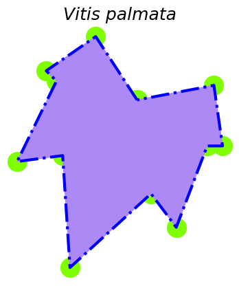

# Práctica

## Práctica con Visualización de gráficos con Matplotlib
______________

Ahora ya has aprendido cómo importar y usar `matplotlib` para graficar y elegir entre una serie de opciones para crear visualizaciones estéticas e informativas. Los datos están ya cargados en este notebook, ¡ahora ya puedes hacer tus gráficos!

**Realiza lo siguiente:**

En la celda a continuación, elige y pega las coordenadas de hojas de una de las especies que tienes enlistadas arriba y crea una gráfica. ***¡Explora y sé creativo!***. Con base a lo que aprendiste en el video, trata de de hacerlo por tu cuenta con los distintos parámetros. Trata de pensar en cómo quieres que luzca tu visualización y si no sabes cómo hacer algo en específico intenta googlearlo para ver si puedes encontrar la respuesta.
Puedes guardar tus gráficos usando la función `plt.savefig( )`. Simplemente agrega la función al final del código de tu gráfico y agrega el nombre que quieres darle, por ejemplo `plt.savefig("myfile.jpg")`. Puedes usar las siguientes extensiones de formato: `.png`, `.pdf`, `.svg`, `.eps`, or `.jpg`. Por default, el archivo será guardado en tu folder o directorio de trabajo actual pero puedes cambiar la dirección en la que quieres que se guarde, por ejemplo: `"./Desktop/myfile.jpg"`.

Recuerda, antes necesitas importar el módulo `matplotlib`.

!Éxito con las visualizaciones!

>💡 ***Recuerde:*** primero debe importar `matplotlib` para poder hacer gráficos. A continuación se muestran los datos con los que trabajaremos en esta lección que se utilizan en el video. Estas son listas de valores de coordenadas `x` e `y` para 15 especies diferentes de *Vitis* y *Ampelopsis*. Ejecute la celda a continuación para leer los datos para completar esta lección.


```python
# Ejecute esta celda para importar matplotlib

import matplotlib.pyplot as plt
%matplotlib inline
```


```python
# Esta celda contiene la lista de valores x y y para  
# las formas de las hojas de las 15 especies de Vitis y Ampelopsis.
# Cada lista está abreviada con la inicial del género y epíteto de la especie.

# Ampelopsis acoutifolia (en realidad aconitifolia)

# NOTA: Hay un error de transcripción para esta especie, que en realidad es
# Ampelopsis aconitifolia (no es A. "acoutifolia")
# El error se propaga en los videos, narración, texto y cuadernos
# pero no afecta la lección en cuestión para trazar en matplotlib
Aaco_x = [13.81197507,-14.58128237,-135.3576208,-3.48017966,-285.0289837,-4.874351136,-126.9904669,10.54932685,170.4482865,40.82555888,205.158889,124.6343366,13.81197507]
Aaco_y = [27.83951365,148.6870909,157.2273013,35.73510131,-30.02915903,9.54075375,-280.2095191,0.200400495,-234.1044141,20.41991159,41.33121759,96.75084391,27.83951365]

# Ampelopsis brevipedunculata
# NOTA: Esta especie ahora se conoce como A. glandulosa var. brevipedunculata
Abre_x = [40.00325135,-81.37047548,-186.835592,-139.3272085,-287.5337006,-89.61277053,-134.9263008,47.43458846,144.6301719,163.5438321,225.9684307,204.719859,40.00325135]
Abre_y = [96.8926433,203.3273536,134.0172438,99.7070006,-81.35389923,-17.90701212,-335.624547,-80.02986776,-262.0385648,-27.31979918,-42.24377429,82.08218538,96.8926433]

# Ampelopsis cordata
Acor_x = [41.26484889,-99.68651819,-203.5550411,-181.4080156,-226.4063517,-174.1104713,-142.2197176,81.25359041,113.9079805,205.9930561,230.8000389,226.6914467,41.26484889]
Acor_y = [105.1580727,209.8514829,131.8410788,111.9833751,-70.79184424,-60.25829908,-326.5994491,-170.6003249,-223.0042176,-44.58524791,-45.80679706,71.64004113,105.1580727]

# Vitis acerifolia
Vace_x = [47.55748802,-102.1666218,-218.3415108,-183.5085694,-234.8755094,-152.1581487,-113.8943819,53.48770667,84.83899263,206.557697,240.589609,243.5717264,47.55748802]
Vace_y = [111.9982016,241.5287104,125.6905949,110.350904,-108.1932176,-74.67866027,-283.2678229,-161.1592736,-243.1116283,-54.52616737,-68.953011,95.74558526,111.9982016]

# Vitis aestivalis
Vaes_x = [34.13897003,-59.06591289,-192.0336456,-169.5476603,-261.8813454,-154.4511279,-132.6031657,56.04516606,119.9789735,205.0834004,246.928663,209.2801298,34.13897003]
Vaes_y = [80.26320349,227.2107718,155.0919347,123.2629647,-86.47992069,-70.12024178,-317.80585,-156.8388147,-247.9415158,-31.73423173,-28.37195726,120.2692722,80.26320349]

# Vitis amurensis
Vamu_x = [36.94310365,-63.29959989,-190.35653,-180.9243738,-255.6224889,-172.8141253,-123.8350652,60.05314983,113.598307,218.8144919,238.6851057,210.9383524,36.94310365]
Vamu_y = [87.06305005,230.9299013,148.431809,128.4087423,-88.67075769,-84.47396366,-298.5959647,-181.4317592,-241.2343437,-37.53203788,-30.63962885,115.7064075,87.06305005]

# Vitis cinerea
Vcin_x = [41.13786595,-78.14668163,-195.0747469,-185.81005,-238.1427795,-181.5728492,-127.6203541,65.24059352,103.8414516,214.1320626,233.1457326,222.7549456,41.13786595]
Vcin_y = [98.40296936,233.6652514,136.6641628,117.9719613,-86.41814245,-86.14771041,-310.2979998,-190.9232443,-230.5027809,-50.27050419,-42.94757891,107.8271097,98.40296936]

# Vitis coignetiae
Vcoi_x = [36.29348151,-51.46279315,-183.6256382,-176.7604659,-253.3454527,-191.8067468,-123.413666,66.11061054,111.4950714,215.7579824,236.7136632,197.5512918,36.29348151]
Vcoi_y = [86.42303732,222.7808161,150.0993737,127.4697835,-85.23634837,-93.3122815,-301.819185,-203.7840759,-239.8063423,-35.30522815,-25.15349577,121.1295308,86.42303732]

# Vitis labrusca
Vlab_x = [33.83997254,-63.35703212,-191.4861127,-184.3259869,-257.3706479,-179.056825,-124.0669143,68.23202857,123.213115,222.8908464,243.056641,205.2845683,33.83997254]
Vlab_y = [81.34077013,222.8158575,153.7885633,132.4995037,-80.2253417,-80.67586345,-296.8245229,-185.0516494,-238.8655248,-38.2316427,-29.21879919,111.424232,81.34077013]

# Vitis palmata
Vpal_x = [31.97986731,-68.77672824,-189.26295,-164.4563595,-260.2149738,-149.3150935,-131.5419837,65.86738801,127.3624336,202.6655429,240.0477009,219.0385121,31.97986731]
Vpal_y = [78.75737572,232.9714762,149.7873103,124.8439354,-71.09770423,-56.52814058,-329.0863141,-149.308084,-231.1263997,-33.22358667,-33.0517181,114.3110289,78.75737572]

# Vitis piasezkii
Vpia_x = [18.70342336,-28.68239983,-133.7834969,-32.76128224,-305.3467215,-7.429223951,-146.2207875,21.81934547,163.1265031,65.21695943,203.4902238,139.6214571,18.70342336]
Vpia_y = [41.05946323,160.3488167,157.9775135,64.93177072,-59.68750782,18.85909594,-362.1788431,7.556816875,-253.8796355,21.33965973,17.69878265,93.72614181,41.05946323]

# Vitis riparia
Vrip_x = [44.65674776,-85.47236587,-205.1031097,-174.088415,-239.9704675,-161.1277029,-125.4900046,58.08609552,89.2307808,204.9127104,236.0709257,229.8098573,44.65674776]
Vrip_y = [106.5948187,235.8791214,130.341464,116.8318515,-110.5506636,-76.73562488,-300.1092173,-169.0146383,-247.0956802,-42.2253331,-54.23469169,103.9732427,106.5948187]

# Vitis rupestris
Vrup_x = [51.29642881,-132.9650549,-227.6059714,-201.31783,-207.965755,-149.2265432,-98.64097334,48.33648281,75.91437502,208.7784453,237.4842778,263.3479415,51.29642881]
Vrup_y = [123.7557878,233.5830974,109.6847731,95.43848563,-95.82512925,-80.06286127,-236.7411071,-163.7331427,-213.2925544,-77.04510916,-86.40789274,69.86940263,123.7557878]

# Vitis thunbergii
Vthu_x = [22.61260382,-3.204532702,-150.3627277,-79.39836351,-271.8885204,-70.74704134,-168.6002498,36.68300146,172.978549,116.9174032,227.8346055,148.3453958,22.61260382]
Vthu_y = [50.82336098,194.3865012,181.2536906,86.8671412,-57.33457233,-23.85610668,-334.279317,-67.36542042,-234.1205595,7.151772223,28.16801823,138.9705667,50.82336098]

# Vitis vulpina
Vvul_x = [39.44771371,-83.62933643,-194.2000993,-175.9638941,-227.8323987,-180.8587446,-135.986247,71.94543538,99.8983207,207.0950158,231.7808734,222.7645396,39.44771371]
Vvul_y = [96.44934373,230.0148139,136.3702366,119.8017341,-83.09830126,-75.38247957,-332.9188424,-184.4324688,-222.8532423,-41.89574792,-44.70218529,101.9138055,96.44934373]

# Average grape leaf
avg_x = [35.60510804,-67.88314703,-186.9749654,-149.5049396,-254.2293735,-135.3520852,-130.4632741,54.4100207,120.7064692,180.696724,232.2550642,204.8782463,35.60510804]
avg_y = [84.95317026,215.7238025,143.85314,106.742536,-80.06000256,-57.00477464,-309.8290405,-137.6340316,-237.7960327,-31.10365842,-30.0828468,103.1501279,84.95317026]
```


```python
# Tu respuesta

```

??? success "Respuesta"
    ```python
    ### RESPUESTA ###

    import matplotlib.pyplot as plt
    %matplotlib inline

    plt.plot(Vpal_x, Vpal_y, color="blue", linestyle="-.", linewidth=3)
    plt.scatter(Vpal_x, Vpal_y, color="chartreuse", s=400)
    plt.fill(Vpal_x, Vpal_y, color="#AD89F5", alpha=1)
    plt.gca().set_aspect('equal', 'box') #datalim or box
    plt.title("Vitis palmata", fontsize=18, style="italic")
    plt.xlabel("x values")
    plt.ylabel("y values")
    plt.axis('off')

    # plt.savefig("myfigure.jpg")
    ```


    
    


