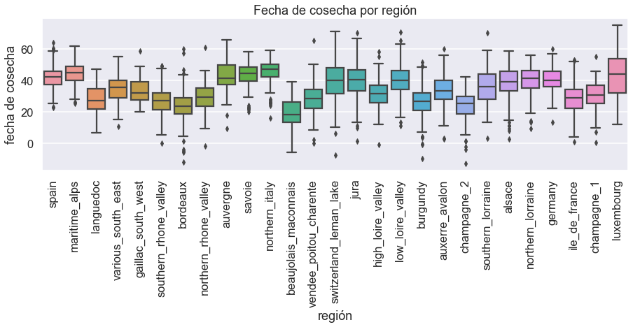
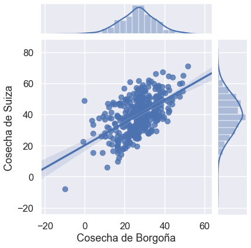
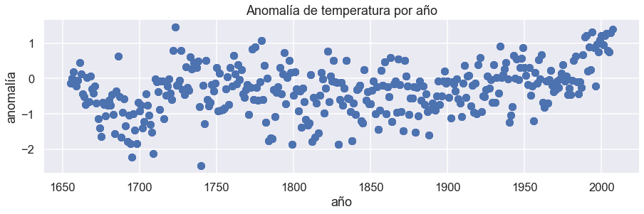
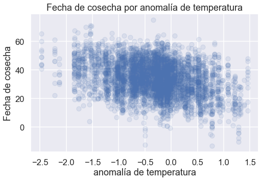
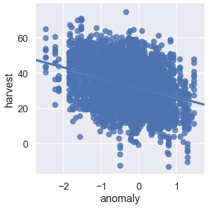
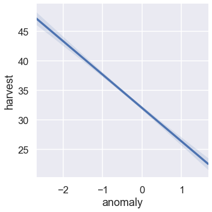

# Actividad 4: Vides en un mundo que se calienta 

___

En la última lección, aprendiste sobre pandas, marcos de datos y seaborn. Aprendiste que las fechas de cosecha de las vides en Europa se han registrado durante siglos y leíste los datos en Jupyter para analizarlos usando "pandas".

En la celda de abajo, importa `pandas` nuevamente, usa la función` pd.read_csv() `para leer los [datos](https://github.com/DanChitwood/PlantsAndPython/blob/master/grape_harvest.csv) (`grape_harvest.csv`) en el uso de la función `pd.read_csv()`, y asegúrate de que los datos estén listos para analizar imprimiendo las salidas de `.head()`, `.tail()`, `.describe() `, y` .columns` funcionan en la celda de abajo.


```python
# Lee aquí el conjunto de datos grape_harvest.csv
# Usa las funciones de pandas para verificar que el conjunto de datos se haya leído correctamente
# Imprime las salidas de las funciones .head(), .tail(), .describe() y .columns
# ¡Recuerda importar pandas!

# Puedes usar este enlace: https://raw.githubusercontent.com/DanChitwood/PlantsAndPython/master/grape_harvest.csv

```

??? success "Respuesta"
    ```python
    ### RESPUESTA ###

    import pandas as pd

    # data = pd.read_csv("grape_harvest.csv")

    data = pd.read_csv('https://raw.githubusercontent.com/DanChitwood/PlantsAndPython/master/grape_harvest.csv')

    print(data.head())
    print(data.tail())
    print(data.describe())
    print(data.columns)
    ```
    ```python
       year  region  harvest  anomaly
    0  1700  alsace     42.9    -0.91
    1  1701  alsace     35.9    -0.76
    2  1702  alsace     45.0    -1.40
    3  1703  alsace     49.4    -1.21
    4  1704  alsace     30.4    -0.44
          year                  region  harvest  anomaly
    4727  1873  vendee_poitou_charente     32.0     0.06
    4728  1874  vendee_poitou_charente      2.0    -0.22
    4729  1875  vendee_poitou_charente     29.0    -1.02
    4730  1876  vendee_poitou_charente     32.0    -0.55
    4731  1877  vendee_poitou_charente     34.0    -0.56
                  year      harvest      anomaly
    count  4732.000000  4732.000000  4732.000000
    mean   1832.835376    33.959510    -0.337811
    std      91.713152    11.807714     0.675309
    min    1655.000000   -13.000000    -2.470000
    25%    1762.000000    25.900000    -0.750000
    50%    1834.500000    34.000000    -0.280000
    75%    1903.000000    42.600000     0.060000
    max    2007.000000    75.000000     1.460000
    Index(['year', 'region', 'harvest', 'anomaly'], dtype='object')
    ```

Ahora que has leído los datos, usemos el enmascaramiento, la visualización de datos y el ajuste de líneas para explorar la relación entre la fecha de cosecha de la uva y el clima a lo largo de los siglos.

___

## Enmascaramiento

### Determinando las fechas de cosecha más tempranas y tardías y dónde ocurrieron

Comenzaremos nuestra exploración de las fechas de cosecha de la uva averiguando cuándo y dónde ocurrieron las fechas de cosecha más temprana y tardía.

El marco de datos de pandas que acabas de crear debe tener cuatro columnas, que son:

* **'año'**: el año en que se recopilaron los datos
* **'región'**: la región de Europa de la que se recopilaron los datos
* **'cosecha'**: la fecha de cosecha registrada. La fecha de cosecha se define como el número de días posteriores al 31 de agosto. Un número negativo significa que las uvas se cosecharon antes del 31 de agosto de ese año y un número positivo después.
* **'anomalía'**: la anomalía de temperatura. Para un año determinado, este número representa cuánto más fría (negativa) o más caliente (positiva) se comparó con un valor de referencia a largo plazo, en grados Celsius.

A continuación, imprime las declaraciones que respondan a las siguientes preguntas utilizando técnicas de enmascaramiento que has aprendido:

1) **¿En qué año ocurrió la cosecha más temprana, en qué región ocurrió y qué tan temprano fue la cosecha?**

2) **¿En qué año ocurrió la última cosecha, en qué región ocurrió y qué tan tarde fue la cosecha?**

**Sugerencia**: recuerda, una máscara es una declaración booleana. Pero esa declaración booleana se puede combinar con funciones de pandas, como .min() o .max(). También recuerda que en el enmascaramiento, la declaración booleana y las funciones de pandas se pueden combinar con columnas específicas por nombre.

**Segunda pista**: después de implementar el enmascaramiento, puedes agregarle la función .values() dentro de su declaración de impresión. Esto te permitirá imprimir los valores recuperados con el enmascaramiento.


```python
# Pon tu código aquí para imprimir en qué año ocurrió la primera cosecha,
# la región en la que ocurrió y qué tan temprano fue la cosecha 


```


```python
# Pon tu código aquí para imprimir en qué año ocurrió la última cosecha,
# la región en la que ocurrió y el retraso de la cosecha 


```

??? success "Respuesta"
    ```python
    ### RESPUESTA ###
    print("La fecha de cosecha más temprana fue en el año")
    print(data['year'][data['harvest'] == data['harvest'].min()].values)
    print("y fue de la región")
    print(data['region'][data['harvest'] == data['harvest'].min()].values)
    print("y fue")
    print(data['harvest'].min(), "días antes del 31 de agosto")
    ```
    ```python
    La fecha de cosecha más temprana fue en el año
    [1822]
    y fue de la región
    ['champagne_2']
    y fue
    -13.0 días antes del 31 de agosto
    ```

??? success "Respuesta"
    ```python
    ### RESPUESTA ###
    print("La última fecha de cosecha fue en el año ")
    print(data['year'][data['harvest'] == data['harvest'].max()].values)
    print("y fue de la región")
    print(data['region'][data['harvest'] == data['harvest'].max()].values)
    print("y fue")
    print(data['harvest'].max(), "días después del 31 de agosto ")
    ```
    ```python
    La última fecha de cosecha fue en el año 
    [1851]
    y fue de la región
    ['luxembourg']
    y fue
    75.0 días después del 31 de agosto 
    ```

### Encontrando fechas medias de cosecha en intervalos de 50 años

¿Quieres saber si la fecha de cosecha de la uva está cambiando y, de ser así, se adelanta o se retrasa?

Decides que te gustaría conocer la fecha mediana de cosecha de la uva para los siguientes intervalos de 50 años, así como la mediana desde el año 2000:

* 1800-1849
* 1850-1899
* 1900-1949
* 1950-1999
* 2000-2007

**Para cada uno de los intervalos anteriores, calcula la fecha mediana de cosecha de la uva. Para cada intervalo, imprime declaraciones que digan "La fecha media de cosecha para los años (*inserta el intervalo aquí*) es: x."**

**Sugerencia:** Puedes escribir declaraciones booleanas para valores dentro de un intervalo como:


``` python
data["column"] >= value & data["column"] <= value
```

**¿La fecha de cosecha de las uvas se adelanta o se retrasa?** 


```python
# Pon tu código aquí 


```

??? success "Respuesta"
    ```python
    ### RESPUESTA ###

    median_1800_1849 = data['harvest'][ (data['year'] >= 1800) & (data['year'] <= 1849) ].median()
    median_1850_1899 = data['harvest'][ (data['year'] >= 1850) & (data['year'] <= 1899) ].median()
    median_1900_1949 = data['harvest'][ (data['year'] >= 1900) & (data['year'] <= 1949) ].median()
    median_1950_1999 = data['harvest'][ (data['year'] >= 1950) & (data['year'] <= 1999) ].median()
    median_2000_2007 = data['harvest'][ (data['year'] >= 2000) & (data['year'] <= 2007) ].median()

    print("La fecha media de cosecha de 1800_1849 fue", median_1800_1849)
    print("La fecha media de cosecha de 1850_1899 fue", median_1850_1899)
    print("La fecha media de cosecha de 1900_1949 fue", median_1900_1949)
    print("La fecha media de cosecha de 1950_1999 fue", median_1950_1999)
    print("La fecha media de cosecha de 2000_2007 fue", median_2000_2007)


    ```

    La fecha media de cosecha de 1800_1849 fue 35.95  
    La fecha media de cosecha de 1850_1899 fue 33.8  
    La fecha media de cosecha de 1900_1949 fue 27.9  
    La fecha media de cosecha de 1950_1999 fue 28.0  
    La fecha media de cosecha de 2000_2007 fue 19.9  


____
## Visualización y correlación

Ahora que comprendes un poco las tendencias generales de los datos, deseas examinar otros factores que podrían influir en la fecha de cosecha de la uva además de los cambios históricos en el clima.

Verás que los datos provienen de muchas regiones, desde la soleada España hasta Alemania. Te preguntas si estas diferencias latitudinales tendrían algún efecto en las fechas de cosecha de la uva.

**Has un diagrama de caja comparando las distribuciones de las fechas de cosecha de uvas donde el eje x es "región" y el eje y "cosecha". Las regiones estarán ordenadas por latitud, de la más meridional a la septentrional. Esto te permitirá evaluar visualmente si la latitud está afectando la fecha de cosecha de la uva.**

Tu diagrama debería:

1. incluir etiquetas de eje (usa las funciones `matplotlib` que ya has aprendido)
2. tener un título (usa las funciones `matplotlib` que ya has aprendido)
3. mantener el tamaño de la figura y los comandos proporcionados en el código siguiente
4. importar `seaborn`
5. finalmente, ordenar las regiones por latitud, desde la más meridional hasta la más septentrional. Para hacer esto, usa la lista provista `latitude_order`. Dentro de la función boxplot `seaborn`, especifica el argumento` order` de la siguiente manera: `order=latitude_order`. Esto organizará las regiones en tu diagrama de caja desde el más meridional hasta la más septentrional.

**Sugerencia:** ¡Ten en cuenta que puedes combinar `matplotlib` y` seaborn`! Puedes llamar a la función de diagrama de caja `seaborn` y aplicar los estilos que desees, pero utiliza las funciones de` matplotlib` que ya conoces para modificar el título, las etiquetas de los ejes y otros atributos del diagrama. ¡Lo mejor de ambos mundos!


```python
# Importa matplotlib y seaborn
# Recuerda la línea de código para configurar las figuras de matplotlib en Jupyter

## NO BORRES LAS LÍNEAS DE CÓDIGO PROPORCIONADAS
## (se incluyen para asegurarse de obtener diagramas de aspecto decente)

plt.figure(figsize=(15,4))

#una lista de regiones, desde la más meridional hasta la más septentrional  
latitude_order = ['spain','maritime_alps','languedoc','various_south_east',
                  'gaillac_south_west','southern_rhone_valley','bordeaux',
                  'northern_rhone_valley','auvergne','savoie','northern_italy',
                  'beaujolais_maconnais','vendee_poitou_charente','switzerland_leman_lake',
                  'jura','high_loire_valley','low_loire_valley','burgundy','auxerre_avalon',
                  'champagne_2','southern_lorraine','alsace','northern_lorraine',
                  'germany','ile_de_france','champagne_1','luxembourg'] 
                    
# Pon tu código aquí

plt.xticks(rotation=90) #Gira las etiquetas del eje x para que sean legibles

```

??? success "Respuesta"
    ```python
    ### RESPUESTA ###
    import matplotlib.pyplot as plt
    %matplotlib inline

    import seaborn as sns
    plt.figure(figsize=(15,4))

    import seaborn as sns
    sns.set("talk") # Pueden usar el estilo seaborn normal si lo desean, o pueden elegir algo. 

    latitude_order = ['spain','maritime_alps','languedoc','various_south_east','gaillac_south_west','southern_rhone_valley','bordeaux','northern_rhone_valley','auvergne','savoie','northern_italy','beaujolais_maconnais','vendee_poitou_charente','switzerland_leman_lake','jura','high_loire_valley','low_loire_valley','burgundy','auxerre_avalon','champagne_2','southern_lorraine','alsace','northern_lorraine','germany','ile_de_france','champagne_1','luxembourg']

    sns.boxplot(x = data['region'], y = data['harvest'], order=latitude_order)
    plt.xlabel("región")
    plt.ylabel("fecha de cosecha")
    plt.title("Fecha de cosecha por región")
    plt.xticks(rotation=90)
    ```

    
    
    


**Según el diagrama, ¿crees que la latitud afecta la fecha de cosecha?** Explica tu razonamiento. Si la fecha de cosecha cambia de sur a norte, ¿cómo afecta esto tu análisis del efecto de la historia y el cambio climático en la fecha de cosecha? Si la fecha de cosecha no se ve afectada por la latitud, ¿cuáles son las implicaciones para tu análisis entonces? 


```python
# Proporciona tu interpretación del diagrama de la relación entre la fecha de cosecha y la latitud 


```

### Buscando correlación en la fecha de cosecha entre Borgoña y Suiza

Te preguntas si las fechas de cosecha de la uva en diferentes regiones están correlacionadas entre sí. Dos regiones con algunos de los registros más largos de fechas de cosecha de uvas son Borgoña ("burgundy") y Suiza ("switzerland_leman_lake"). Te gustaría examinar la correlación entre las fechas de cosecha de la uva en estos dos lugares. Pero primero, debes asegurarte de que haya una fecha de cosecha de uva coincidente para cada año entre estas regiones.

Tu tarea a continuación es:

**1. Crear dos marcos de datos enmascarados, uno llamado "Borgoña" con solo datos de "burgundy" y el otro llamado "Suiza", con solo datos de "switzerland_leman_lake".**

**2. Luego, utilizando el código de función "merge" que se proporciona a continuación, crea un conjunto de datos en el que cada año de datos "Borgoña" registrados tenga un año coincidente o datos "Suiza" registrados. Asegúrete de inspeccionar los nombres de las columnas**

**3. Con tu nuevo marco de datos combinado llamado "burgundy_switzerland", imprime el año más antiguo y el más reciente en tus nuevos datos combinados.** 


```python
# NO BORRES EL CÓDIGO PROPORCIONADO PARA FUSIONAR MARCOS DE DATOS

# Debajo de este punto, primero crea dos conjuntos de datos enmascarados, "borgoña" y "suiza", que contengan solo los datos de
# regiones "burgundy" y "switzerland_leman_lake", respectivamente, mediante el uso de máscaras

# Pon tu código aquí para los marcos de datos enmascarados "borgoña" y "suiza"

burgandy =

switzerland =

# Después de crear tus marcos de datos enmascarados arriba, usa la función de fusión a continuación para crear un solo marco de datos
# Verifica los nombres de las columnas de tu nuevo conjunto de datos combinado. Los datos "borgoña" tendrán "x" después y los
# datos de "suiza" "y". "año" no tendrá "x" ni "y" porque se comparte entre los marcos de datos

burgundy_switzerland = burgundy.merge(switzerland, on='year')
print(burgundy_switzerland.columns)

# Luego, encuentra los años mínimos y máximos representados en este nuevo conjunto de datos fusionado
# A continuación, imprime declaraciones de los primeros y últimos años

# Pon tu código aquí para los años mínimo y máximo en tu marco de datos fusionado "burgundy_switzerland" 

```

??? success "Respuesta"
    ```python
    ### RESPUESTA ###

    burgundy = data[ data['region'] == 'burgundy' ]
    switzerland = data[ data['region'] == 'switzerland_leman_lake' ]

    burgundy_switzerland = burgundy.merge(switzerland, on='year')
    print(burgundy_switzerland.columns)

    min_year = burgundy_switzerland['year'].min()
    max_year = burgundy_switzerland['year'].max()

    print("El primer año de estos datos es", min_year, "y el último año en estos datos es", max_year)


    ```
    ```python
    Index(['year', 'region_x', 'harvest_x', 'anomaly_x', 'region_y', 'harvest_y',
           'anomaly_y'],
          dtype='object')
    El primer año de estos datos es 1655 y el último año en estos datos es 2006
    ```

Ahora que tienes datos que coinciden, con exactamente una observación "burgundy" y una "switzerland_leman_lake" para cada año, puedes examinar si las fechas de cosecha de la uva están correlacionadas.

Usando la función seaborn `jointplot()` (documentación [aquí](https://seaborn.pydata.org/generated/seaborn.jointplot.html)), haz un diagrama de dispersión con distribuciones en los lados para ver esta correlación. **¡Asegúrate de que tu diagrama incluya la línea de regresión!** 


```python
### PON TU CÓDIGO AQUÍ


```

??? success "Respuesta"

    ```python
    ### RESPUESTA ###

    sns.jointplot(burgundy_switzerland['harvest_x'], burgundy_switzerland['harvest_y'], kind="reg")
    plt.xlabel("Cosecha de Borgoña")
    plt.ylabel("Cosecha de Suiza")
    ```
    
    
    


**Pregunta**: La correlación es la relación entre dos variables: por ejemplo, cuando una variable aumenta de valor, la otra también aumenta (correlación positiva) o cuando una variable aumenta de valor la otra disminuye (correlación negativa). La variabilidad es qué tan dispersos están los datos o qué tan agrupados.

¿Crees que la fecha de cosecha entre las dos regiones está correlacionada? ¿Positivamente o negativamente? ¿Qué tan variables son los datos? ¿La variabilidad es constante a lo largo de las fechas de cosecha? ¿Qué puedes aprender de tu diagrama? 


```python
# Proporciona tu interpretación de tu diagrama aquí. 

```

## Graficando la anomalía de temperatura frente al año y la fecha de cosecha frente a la anomalía de temperatura

Te has estado preguntando todo este tiempo: ¿la temperatura aumenta con el tiempo?

Para encontrar la respuesta a esta pregunta, **a continuación, crea un diagrama de dispersión con "anomalía" en el eje y y "año" en el eje x.** Asegúrate de que tus diagramas tengan etiquetas y un título.

**Recuerda:** Si ya has importado en `seaborn`, si usas las funciones de` matplotlib`, tus diagramas seguirán teniendo el estilo de `seaborn` y podrás consultar marcos de datos y columnas específicas dentro de las funciones de` matplotlib` que ¡ya has aprendido! Utiliza las funciones `matplotlib` y consulta tu marco de datos y columnas por nombre y ve qué sucede. 


```python
## NO BORRES LAS LÍNEAS DE CÓDIGO PROPORCIONADAS
## (se incluyen para asegurarse de que obtengas diagramas de aspecto decente) 
plt.figure(figsize=(15,4))


# PON TÚ CÓDIGO AQUÍ

```

??? success "Respuesta"
    ```python
    ### RESPUESTA ###

    plt.figure(figsize=(15,4))

    plt.scatter(x = data['year'], y = data['anomaly'])
    plt.xlabel("año")
    plt.ylabel("anomalía")
    plt.title("Anomalía de temperatura por año")
    ```
    
    
    


Vez que, de hecho, la temperatura aumenta con el tiempo. El patrón clásico de "palo de hockey". Deseas ver si la fecha de cosecha se ve afectada por la anomalía de temperatura. Como arriba, **a continuación, crea un diagrama de dispersión con "fecha de cosecha" en el eje y y "anomalía" en el eje x**. Asegúrate de que tus parcelas tengan etiquetas y un título.

**Sugerencia**: estás trazando una gran cantidad de datos y será difícil ver la relación subyacente debido a la superposición. Puedes insertar el argumento `alpha` en la función `scatter()` para crear transparencia y ver mejor tus datos. Puedes comenzar con un alfa tan bajo como 0.1 (por ejemplo, `alpha=0.1`) y ajustarlo más alto si lo deseas. 


```python
## NO BORRES LAS LÍNEAS DE CÓDIGO PROPORCIONADAS
## (se incluyen para asegurarse de que obtengas diagramas de aspecto decente) 
plt.figure(figsize=(8,5))


# PON TÚ CÓDIGO AQUÍ

```
??? success "Respuesta"

    ```python
    ### RESPUESTA ###

    plt.figure(figsize=(8,5))
    plt.scatter(x = data['anomaly'], y = data['harvest'], alpha=0.1)
    plt.xlabel("anomalía de temperatura")
    plt.ylabel("Fecha de cosecha")
    plt.title("Fecha de cosecha por anomalía de temperatura")
    ```
    
    
    


**Pregunta:** Según tu diagrama, ¿existe una correlación entre la fecha de cosecha y la anomalía de temperatura? Si es así, ¿es positiva o negativa? ¿Crees que la relación es lineal o curva, como tu diagrama de anomalía de temperatura frente al año? 


```python
# Escribe aquí tus pensamientos sobre la relación entre la fecha de cosecha y la temperatura aquí 

```

### Modelando la fecha de cosecha en función de la anomalía de temperatura usando `seaborn`

Te preguntas si la fecha de "cosecha" puede modelarse en función de la "anomalía" de la temperatura. Incluso sospechas, después de graficar "cosecha" versus "anomalía" arriba, si esta relación podría ser lineal. ¡Te sorprende saber que, de hecho, otros sugieren que esta relación es lineal! En la [publicación](https://www.clim-past.net/8/1403/2012/cp-8-1403-2012.pdf) de donde se obtuvo estos datos, se sugiere que otros han encontrado que **para ¡Cada 1C de aumento de temperatura, la fecha de cosecha es en promedio 10 días antes!**

Te propusiste crear un modelo lineal que predice "cosecha" como una función de "anomalía" y te das cuenta de que esto es fácil de hacer usando la función `sns.lmplot()`! Lee la documentación de `sns.lmplot()` [aquí](https://seaborn.pydata.org/generated/seaborn.lmplot.html) y haz un gráfico, con un ajuste lineal mostrando, la fecha de cosecha frente a la anomalía de temperatura . 


```python
# Haz tu sns.lmplot() aquí 


```

??? success "Respuesta"
    ```python
    ### RESPUESTA ###

    sns.lmplot(x ='anomaly', y = 'harvest', data=data)


    ```
    
    
    


¡Parece haber mucho sobretratamiento con demasiados puntos! En la celda de abajo, usa el argumento `scatter=False` para eliminar los puntos de datos para que podamos ver solo la línea ajustada. 


```python
# Elimina los puntos de datos de tu diagrama en esta celda 

```

??? success "Respuesta"
    ```python
    ### RESPUESTA ###

    sns.lmplot(x ='anomaly', y = 'harvest', data=data, scatter=False)
    ```
    
    
    


Mira la línea ajustada e intenta estimar la pendiente. Recuerda, la pendiente es el cambio unitario en los valores $y$ dividido por el cambio unitario en los valores $x$. Por cada grado Celsius, ¿cuántos días cambia aproximadamente la cosecha? 


```python
# Pon tu estimación de cuántos días cambia la cosecha por cada grado de anomalía de temperatura en grados Celsius.


```

??? success "Respuesta"

    ```python
    ### RESPUESTA ###

    print ("Son unos 5 días de cosecha por cada grado Celsius.")
    ```

    Son unos 5 días de cosecha por cada grado Celsius.


Recuerda, en la Actividad 1 indexaste la anomalía de la temperatura global durante tu vida para ver cuánto han cambiado las temperaturas globales desde que naciste. Como estimación aproximada, veamos cuántos días de aumento de temperatura de este tipo podría haber afectado la cosecha de uvas.

En la celda de abajo, los valores de anomalía de temperatura que comienzan en el año 1900 a 2020 se proporcionan en una lista llamada `temp_anomaly`. Estos datos son de [NASA](https://climate.nasa.gov/vital-signs/global-temperature/). Ejecuta la celda a continuación para crear la lista.

**Recuerda:** Esta lista comienza en 1900 a 2020 y la indexación en Python comienza en 0. 


```python
temp_anomaly = [-0.19,-0.23,-0.25,-0.28,-0.3,-0.33,-0.36,-0.37,-0.39,-0.4,-0.41,-0.38,
                -0.35,-0.32,-0.31,-0.3,-0.29,-0.29,-0.29,-0.29,-0.27,-0.26,-0.25,-0.24,
                -0.23,-0.22,-0.21,-0.2,-0.19,-0.19,-0.19,-0.19,-0.18,-0.17,-0.16,-0.14,
                -0.11,-0.06,-0.01,0.03,0.06,0.09,0.11,0.1,0.07,0.04,0,-0.04,-0.07,-0.08,
                -0.08,-0.07,-0.07,-0.07,-0.07,-0.06,-0.05,-0.04,-0.01,0.01,0.03,0.01,
                -0.01,-0.03,-0.04,-0.05,-0.06,-0.05,-0.03,-0.02,0,0,0,0,0.01,0.02,0.04,
                0.07,0.12,0.16,0.2,0.21,0.22,0.21,0.21,0.22,0.24,0.27,0.31,0.33,0.34,
                0.33,0.33,0.34,0.34,0.37,0.4,0.43,0.45,0.48,0.51,0.53,0.55,0.59,0.61,
                0.62,0.63,0.64,0.65,0.65,0.65,0.67,0.7,0.74,0.79,0.83,0.88,0.91,0.95,
                0.98,1.01]
```

En la celda de abajo, indexa la lista desde el año de tu nacimiento hasta el año 2020. Observa la diferencia de anomalías desde tu nacimiento hasta el 2020 y estima aproximadamente cuánto afectaría tal cambio en la temperatura la fecha de cosecha de las uvas.

**Sugerencia:** Recuerda que -1 puede indexar el último elemento de una lista. 


```python
# PON TU CÓDIGO AQUÍ


```
??? success "Respuesta"

    ```python
    ### RESPUESTA ###

    my_life = temp_anomaly[81:]
    difference = temp_anomaly[-1] - temp_anomaly[81]
    difference*5
    ```

    4.0


Al volver a examinar tu diagrama de anomalías de temperatura en función del año, ¿tiene sentido tu resultado? ¿Qué dice esto sobre el ritmo del cambio climático y las implicaciones para la agricultura? 


```python
# Escribe tus pensamientos sobre el ritmo del cambio climático y sus implicaciones. 

```
