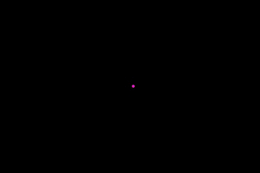
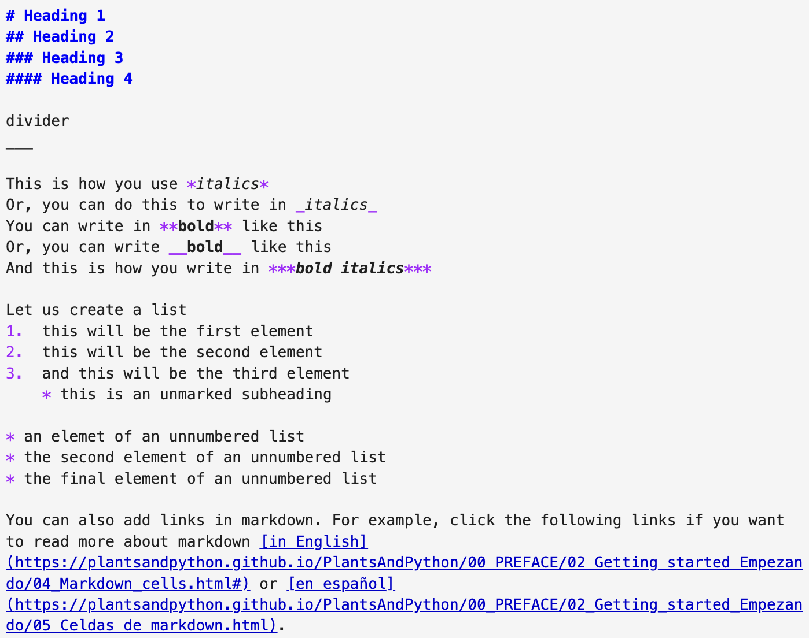
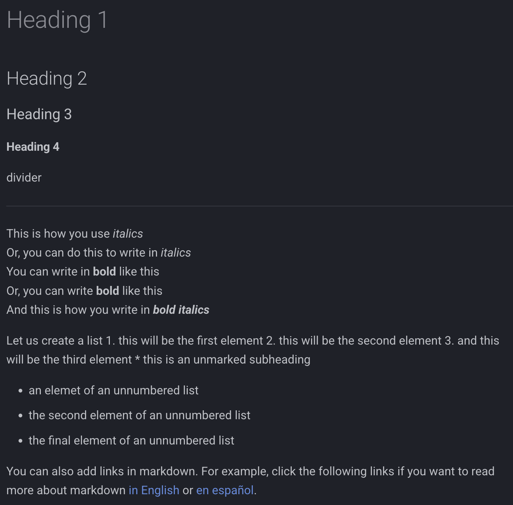
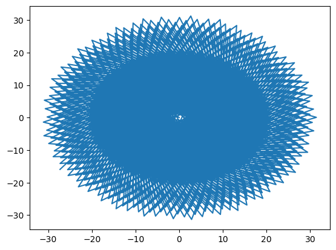
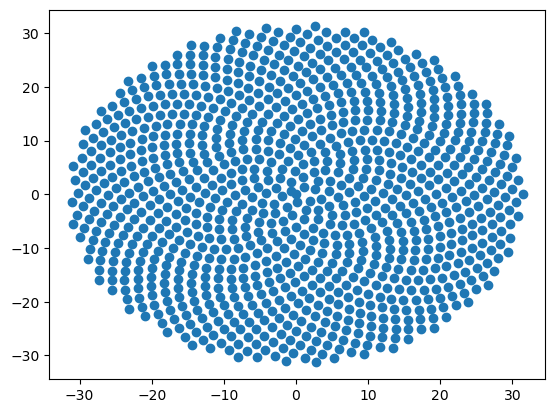
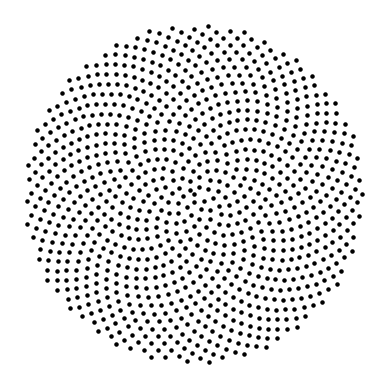
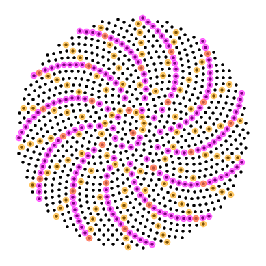
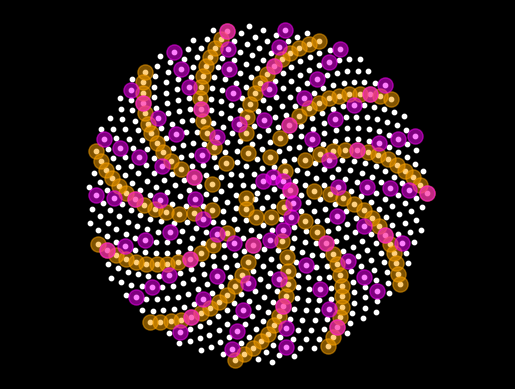

# Welcome to / Bienvenid@ a Plants&Python 🪴🐍🪴

This Quick Start guide was originally developed for a workshop held during the [XX Sociedad Mexicana de Bioquímica National Plant Biochemistry and Molecular Biology Congress](https://smbplant.quimica.unam.mx/) in Oaxaca, México, 16-20 October 2023.

The workshop will be held before the meeting starts the first day.  
**When:** Monday 16 October 2023, at 11am  
**Where:** [Centro Cultural San Pablo](https://fahho.mx/filiales-fahho/centro-cultural-san-pablo/), Hidalgo 907 e Independencia 904, Centro, Oaxaca, C.P. 68000 

Dr. Dan Chitwood (Michigan State University) and Dr. Alejandra Rougon (ENES-León, UNAM) will teach the workshop. We will use the [Plants&Python](https://plantsandpython.github.io/PlantsAndPython) learning materials.

[Plants&Python](https://plantsandpython.github.io/PlantsAndPython) is available in English and Spanish. It is designed to provide an introduction to coding principles in the Python coding language. If you have no coding experience, then Plants&Python is meant for you!

Please watch the [welcome video](https://plantsandpython.github.io/PlantsAndPython/00_PREFACE/01_Welcome_Bienvenido/00_Welcome.html), por favor mira el [vídeo de bienvenida](https://plantsandpython.github.io/PlantsAndPython/00_PREFACE/01_Welcome_Bienvenido/01_Bienvenido.html).



## Preparation for the workshop  

Before the workshop, try to download Anaconda, which includes Python, Jupyter notebooks, and Python modules we will use. Select your operating system from this [link](https://docs.anaconda.com/free/anaconda/install/) and follow the instructions. You can also watch a video to install Anaconda, in [English](https://plantsandpython.github.io/PlantsAndPython/00_PREFACE/02_Getting_started_Empezando/00_Installing_Anaconda.html) y en [español](https://plantsandpython.github.io/PlantsAndPython/00_PREFACE/02_Getting_started_Empezando/01_Instalar_Anaconda.html).

If you can not download Anaconda or don't have the time, no worries! You can attend the workshop and watch and use the [Plants&Python](https://plantsandpython.github.io/PlantsAndPython) materials on your own time.

## Using Jupyter notebooks

The words you are reading and the code you see are all in a Jupyter notebook! Jupyter notebooks are a file that allow for coding together with text (called ***markdown***) and embedded pictures and videos. They are great for teaching and education as well as reproducible research using Python.

If you have installed Anaconda, you can open this Jupyter notebook and code along during the workshop! Either type `jupyter notebook` in the terminal application on your computer, or select the Anaconda navigator and click `launch Jupyter notebook`. Jupyter will open in your internet browser, and you can navigate to the folder where you have stored this file, `Oaxaca_workshop.ipynb`, and open it. Follow the instructions here, in [English](https://plantsandpython.github.io/PlantsAndPython/00_PREFACE/02_Getting_started_Empezando/00_Installing_Anaconda.html) or en [español](https://plantsandpython.github.io/PlantsAndPython/00_PREFACE/02_Getting_started_Empezando/01_Instalar_Anaconda.html).

The types of cells are markdown and coding. The words you are reading are in markdown! If you have opened this Jupyter notebook file (`Oaxaca_workshop.ipynb`), you can double click on this cell and see the markdown code that generated this text. To return to the formatted text, press `shift + enter`.

Below, you can see some markdown formatting. Compare the original markdown code to the output formatted text.




## Variables and your first Python code!

Let's write some code! Coding in Python is easy, and it all begins with variables. You can read more, [in English](https://plantsandpython.github.io/PlantsAndPython/00_PREFACE/02_Getting_started_Empezando/02_Coding_cells.html) or [en español](https://plantsandpython.github.io/PlantsAndPython/00_PREFACE/02_Getting_started_Empezando/03_Celdas_de_codigo.html), about writing code in Jupyter notebooks.


```python
# Let's write some code to calculate the area of a circle
# by using the #hashtag, Python will ignore the text after "#",
# allowing us to write comments to interpret our code

pi = 3.14159 # we use "=" to set a variable value. This is pi
r = 2 # our radius value

Area = pi*r**2 # we can use our variables for calculations, "**" is for exponents

Area # we can simply write the variable to see it's value

# Press shift + enter to execute the code
```


    12.56636


```python
# or, we can use the "print()" function to print its value
print(Area)
```

    12.56636


## Lists and indexing

A list is a type of variable. Lists can hold any type of data, including integers (numbers like `1`, `2`, and `3`), floats (decimals, like `3.14159`), and strings (letters, which we indicate using quotes, like `"Oaxaca"` or `'Oaxaca'`.

We create a list with square brackets and separating values with commas, like this:


```python
# let's create our first list, with integers, floats, and a string
my_list = [1, 2, 3, 3.14159, "Oaxaca"] 

print(my_list)
```

    [1, 2, 3, 3.14159, 'Oaxaca']


**Workshop activity:**
    
Let's introduce ourselves! We will create four lists, with our names, apellidos, the country or state in México we are coming from, and our favorite plant. Notice that number of items in the lists and their order is the same.

Alejandra and I will go first!


```python
# a list of workshop participant names!
nombre = ["Dan",
         "Alejandra"
         ]
# a list of workshop participant last names!
apellido = ["Chitwood",
           "Rougon"
           ]

# a list of the country or Mexican state participants are from!
estado_o_pais = ["Estados Unidos",
                "Guanajuato"
                ]

# a list of the favorite plants of the participants
planta_favorita = ["jacaranda",
                  "helecho"
                  ]
```

Indexing is a way to access items in a list. Indexing starts with `0`. That is, the first element of the list is indexed by `0`, the second element by `1`, the third element by `2`.

Let's assign a variable, `i`, an index value. We will use the index value to access information across the lists.


```python
i = 0 # index position. Index values start on 0

print(nombre[i]) # print the index position i of list nombre
print(apellido[i]) # print the index position i of list apellido
print(estado_o_pais[i]) # print the index position i of estado_o_pais
print(planta_favorita[i]) # print the index position i of list planta_favorita
```

    Dan
    Chitwood
    Estados Unidos
    jacaranda


Let's use the `print()` function to create a sentence using indexing:


```python
i = 1 # index position. Index values start on 0

# print the sentence "X es de X y su planta favorita es X"
print(nombre[i], apellido[i], "es de", estado_o_pais[i], 
      "y su planta favorita es", planta_favorita[i])
```

    Alejandra Rougon es de Guanajuato y su planta favorita es helecho


## Loops


Loops allow us to change the value of a variable, using a process called ***iteration***. Each time we ***iterate*** over a value, we change the value of the variable, allowing us to index over many values, or to perform multiple calculations.  

The most common loop is a `for` loop. We can directly iterate over the values in a list. Let's try to iterate over the values in our list `planta_favorita`:


```python
for planta in planta_favorita:
    
    print(planta)
```

    jacaranda
    helecho


We can also loop by using index. Using the `range()` function, we can iterate over integer values. Let's try it out!


```python
for i in range(5):
    
    print(i)
```

    0
    1
    2
    3
    4


We can conveniently use the `len()` function to determine how many elements are in a list. Then, using the list length with `range()`, we can iterate over each index position in a list.


```python
len(nombre)
```


    2


```python
for i in range(len(nombre)):
    
    print(i)
```

    0
    1


```python
for i in range(len(nombre)):
    
    print(nombre[i], apellido[i], "es de", estado_o_pais[i], 
      "y su planta favorita es", planta_favorita[i])
```

    Dan Chitwood es de Estados Unidos y su planta favorita es jacaranda
    Alejandra Rougon es de Guanajuato y su planta favorita es helecho


We can create an empty list outside of a loop. The empty list can be used to store values that are generated by the loop. Using the `.append()` function, we can add a new element to the list as it is generated within the loop. The format of `.append()` is different from what we've seen before. It takes the form of `my_list.append(item_to_append)`, where `item_to_append` will be added to `my_list`.

Let's see how it works! In this loop, we will create a new list called `lista_nombre_completo` that stores a new variable called `nombre_completo`.  We use a `for` loop by index to find the correct `nombre` and `apellido` to use.


```python
lista_nombre_completo = [] # create an empty list to store results

for i in range(len(nombre)):
    
    nombre_completo = nombre[i] + "_" + apellido[i] # create the variable nombre completo
    
    lista_nombre_completo.append(nombre_completo) # add or append the variable to the end of the list
    
```


```python
print(lista_nombre_completo)
```

    ['Dan_Chitwood', 'Alejandra_Rougon']


## How to build a sunflower, Part 1:
### Calculating the golden angle using loops

The Fibonacci sequence adds the previous two terms to create the next term. It starts with `1, 1`, followed by: 

`1 + 1 = 2`,  
`1 + 2 = 3`,  
`2 + 3 = 5`,  
`3 + 5 = 8`,  
`5 + 8 = 13`,  
`8 + 13 = 21`,  
and so on.   

The Fibonacci sequence can be used to calcualte the golden ratio and the golden angle. Let's try to calculate it using loops!


```python
fibonacci_seq = [1,1] # a list to store the Fibonacci series, with the first 2 elements

for n in range(2,11,1): # starting on 2, up to not including 11, increments of 1
    
    n_minus_2 = fibonacci_seq[n-2] # find the n-2 element of the series
    n_minus_1 = fibonacci_seq[n-1] # find the n-1 elemet of the series
    
    n_value = n_minus_2 + n_minus_1 # add the n-2 and n-1 elements for the new element
    
    print("the", n, "value is", n_value) # print out the new element
    
    fibonacci_seq.append(n_value) # add the new element to the list
```

    the 2 value is 2
    the 3 value is 3
    the 4 value is 5
    the 5 value is 8
    the 6 value is 13
    the 7 value is 21
    the 8 value is 34
    the 9 value is 55
    the 10 value is 89


We can simplify our code


```python
fibonacci_seq = [1,1] # a list to store the Fibonacci series, with the first 2 elements

for n in range(2,30,1): # starting on 2, up to not including 30, increments of 1

    fibonacci_seq.append(fibonacci_seq[n-2] + fibonacci_seq[n-1]) # calculate the next element of the series
    
```


```python
fibonacci_seq
```


    [1,
     1,
     2,
     3,
     5,
     8,
     13,
     21,
     34,
     55,
     89,
     144,
     233,
     377,
     610,
     987,
     1597,
     2584,
     4181,
     6765,
     10946,
     17711,
     28657,
     46368,
     75025,
     121393,
     196418,
     317811,
     514229,
     832040]


With a loop, you can calculate multiple things using the same indices. For example, the golden ratio is the ratio of the `n` divided by the `n-1` value of the Fibonacci series. Let's calculate the Fibonacci series and golden ratio at the same time.


```python
fibonacci_seq = [1,1] # a list to store the Fibonacci series, with the first 2 elements
golden_ratio_list = [] # a list to store the golden ratio

for n in range(2,30,1): # starting on 2, up to not including 30, increments of 1

    fibonacci_seq.append(fibonacci_seq[n-2] + fibonacci_seq[n-1]) # calculate the next element of the series
    
    golden_ratio_list.append(fibonacci_seq[n] / fibonacci_seq[n-1]) # calculate the golden ratio
    
```


```python
golden_ratio_list
```


    [2.0,
     1.5,
     1.6666666666666667,
     1.6,
     1.625,
     1.6153846153846154,
     1.619047619047619,
     1.6176470588235294,
     1.6181818181818182,
     1.6179775280898876,
     1.6180555555555556,
     1.6180257510729614,
     1.6180371352785146,
     1.618032786885246,
     1.618034447821682,
     1.6180338134001253,
     1.618034055727554,
     1.6180339631667064,
     1.6180339985218033,
     1.618033985017358,
     1.6180339901755971,
     1.618033988205325,
     1.618033988957902,
     1.6180339886704431,
     1.6180339887802426,
     1.618033988738303,
     1.6180339887543225,
     1.6180339887482036]


The golden angle (in degrees) is $360\times{1\over\phi^2}$, where $\phi$ is the golden ratio.  
So, our estimate of the golden angle in degrees is:


```python
golden_ratio = golden_ratio_list[-1] # get the last element of the golden ratio list

golden_angle = 360*(1/golden_ratio**2) # approximate the golden angle

print(golden_angle) # print the golden angle in degrees
```

    137.5077640503253


The real value of the golden angle is $180\times(3-\sqrt5)$


```python
real_golden_angle = 180*(3-5**(1/2))

print(real_golden_angle)
```

    137.50776405003785


We were close to the real value!

## How to build a sunflower, Part 2:
### Building and plotting our sunflower

We have the golden angle! Now we can build our sunflower!

Every successive floret of a sunflower is separated by the golden angle. The distance of each floret to the center is the square root of the order it was initiated. For every floret `n`, the angle (`theta`, in radians) and distance (radius, `r`) is therefore:

````python
theta = n*golden_angle
r = sqrt(n)
````

Once we have calcualted `theta` and `r`, we can calcualte `x` and `y` coordinates for our sunflower using the following equations:

```python
x = r * cos(theta)
y = r * sin(theta)
```

Before we construct our sunflower, we need to import modules. In Python, modules are sets of useful functions. Two important modules that we will be using today are `math` for mathematical functions, and `matplotlib.pyplot`, which allows us to plot. We need to reference the module a function comes from before using it, and we can abbreviate it. We will leave `math` as `math`, but we will shorten `matplotlib.pyplot` to `plt`.

In the cell below, we import the `math` and `matplotlib.pyplot` modules to use their functions:


```python
import math

import matplotlib.pyplot as plt
%matplotlib inline
```

Below, let's convert the golden angle to radians. Note the use of `math.pi` to get the value of $\pi$.


```python
real_golden_angle = 180*(3-5**(1/2)) # the golden angle in degrees

gold_ang_rad = real_golden_angle * ( math.pi / 180.0 )  # the golden angle in radians
```

We are ready to calculate the coordinates of our sunflower! Study the code below, which calculates the `x` and `y` coordinates for 1000 florets.


```python
xlist = [] # a list to store x coordinate values
ylist = [] # a list to store y coordinate values

for n in range (0, 1000, 1): # starting on 0, iterate 1000x, increments of 1
    
    # First, calculate theta and radius for n
    theta = n * gold_ang_rad 
    r = math.sqrt(n) 
    
    # Second, calculate x and y coordinate values for n
    x = r * math.cos(theta)
    y = r * math.sin(theta)

    # Finally, store and append x and y values to a list
    xlist.append(x)
    ylist.append(y)
```

We can check our `xlist` and `ylist` values using indexing, and their length using the `len()` function.


```python
print("The first five xlist values are", xlist[0:5]) # print the first 5 xlist values
print("The first five ylist values are", ylist[0:5]) # print the first 5 ylist values

print("The length of xlist is", len(xlist)) # print the length of xlist
print("The length of ylist is", len(ylist)) # print the length of ylist
```

    The first five xlist values are [0.0, -0.7373688780783197, 0.12363864559502138, 1.053847020514727, -1.9694269706308574]
    The first five ylist values are [0.0, 0.6754902942615238, -1.4087985964343621, 1.3745568221620497, -0.3483639007586233]
    The length of xlist is 1000
    The length of ylist is 1000


But we want to ***see*** the `xlist` and `ylist` values, they are our sunflower!!!

Let's try the most famous `matplotlib` function, `plt.plot()`. `plt.plot()` takes a list of x values and a list of y values, which we have!

Let's try it!


```python
plt.plot(xlist, ylist)
```


    [<matplotlib.lines.Line2D at 0x7fce76a63d60>]


    

    


Interesting. But maybe we want points, not lines. Let's try `plt.scatter()` instead.


```python
plt.scatter(xlist, ylist)
```


    <matplotlib.collections.PathCollection at 0x7fce76e8c520>


    

    


That is looking better!

There are may functions in `matplotlib`. Let's try some out and make a better looking sunflower!


```python
size = 5 # set point size
color = "black" # set point color
transparent = 1 # set alpha, or transparency
# for colors, see https://matplotlib.org/stable/gallery/color/named_colors.html

plt.scatter(xlist, ylist, s=size, c=color, alpha=transparent) # plot out points
plt.gca().set_aspect("equal") # set aspect ratio to equal
plt.axis("off") # remove plot axes
```


    (-34.240980675327435, 34.54297213836181, -34.449612822885, 34.40183494344153)


    

    


Do you see patterns in the sunflower? The spiral arms you see in the phyllotaxy of plants are called ***parastichies***. The parastichies are defined by taking every `nth` element of the phyllotaxy series, where `n` is a member of the Fibonacci series.

For indexing, remember there are three elements, separated by colon: the start, up to but not including the end, and a step. The step takes every `nth` element in a list. Full indexing looks like this:

```python
my_list[start:end:step]
````

Let's try to find our parastichies in the code below!


```python
size = 5 # set point size
color = "black" # set point color
transparent = 1 # set alpha, or transparency
# for colors, see https://matplotlib.org/stable/gallery/color/named_colors.html

plt.scatter(xlist, ylist, s=size, c=color, alpha=transparent) # plot out points

plt.scatter(xlist[::5], ylist[::5], c="magenta", alpha=0.5) # parastichy 5
plt.scatter(xlist[::8], ylist[::8], c="orange", alpha=0.5) # parastichy 8

plt.gca().set_aspect("equal") # set aspect ratio to equal
plt.axis("off") # remove plot axes
```


    (-34.240980675327435, 34.54297213836181, -34.449612822885, 34.40183494344153)


    

    


## How to build a sunflower, Part 3:
### Complex code and going forward in your coding journey!

That is an introduction to Python! It is impossible to teach you everything in an hour! Coding is a lifelong journey, and we hope the [Plants&Python](https://plantsandpython.github.io/PlantsAndPython) resources can help you get started! Ask questions, google, and research, and you will find the answers to allow you to code whatever your intended goals are!  

Below, is some fun code to try and make a model of a growing sunflower. Let's take the concepts we have learned and apply them to something more complex.  

Let's introduce one more concept: the double loop. A double loop has a loop inside a loop. In the example below, for each value of `i` that is iterated, the inner loop iterates over each value of `j`. Once all `j` values have been iterated, the inner loop exits and go back to the outer loop and the next values of `i`. 

Try to understand how the two loops below work:


```python
for i in range(5): # the outer loop
    
    for j in range(5): # the inner loop
        
        print("i is", i, "and j is", j)
```

    i is 0 and j is 0
    i is 0 and j is 1
    i is 0 and j is 2
    i is 0 and j is 3
    i is 0 and j is 4
    i is 1 and j is 0
    i is 1 and j is 1
    i is 1 and j is 2
    i is 1 and j is 3
    i is 1 and j is 4
    i is 2 and j is 0
    i is 2 and j is 1
    i is 2 and j is 2
    i is 2 and j is 3
    i is 2 and j is 4
    i is 3 and j is 0
    i is 3 and j is 1
    i is 3 and j is 2
    i is 3 and j is 3
    i is 3 and j is 4
    i is 4 and j is 0
    i is 4 and j is 1
    i is 4 and j is 2
    i is 4 and j is 3
    i is 4 and j is 4


The double loop is important if we want to make a growing model of a sunflower. The way we currently calculate the `x` and `y` coordinate values is a problem. Let's say our strategy is to take 1 floret, then 2 florets, then 3 florets, and so on, just like a sunflower grows. The way we currently have the code, the first floret will always have the shortest radius! In order to make sure the first floret continues to grow in its radius length, we need to ***reverse*** the order of the radius list each time we add a floret.

This is some ***psuedo-code*** to help understand this problem:

```python
# we start with the first floret
thetas = [1*gold_ang_rad]
radius = [sqrt(1)] 
reverse_radius = [sqrt(1)]

# we add the second floret
thetas = [1*gold_ang_rad , 2*gold_ang_rad] # the angles of each floret
radius = [sqrt(1), sqrt(2)] # but the first floret should have the longest radius, not shortest!
reverse_radius = [sqrt(2), sqrt(1)] # reverse the radius list order. Now first floret has longest radius

# we add the third floret
thetas = [1*gold_ang_rad , 2*gold_ang_rad, 3*gold_ang_rad] # the angles of each floret
radius = [sqrt(1), sqrt(2), sqrt(3)] # but the first floret should have the longest radius, not shortest!
reverse_radius = [sqrt(3), sqrt(2), sqrt(1)] # reverse the radius list order. Now first floret has longest radius
````

When making long, complex code, it's important to have a plan and to sketch out your thoughts with pseudo-code. Here is some more pseudo-code for our growing sunflower!

```python

# First, pre-calculate thetas and radii

theta_list # store thetas
radii_list # store radii

for n in range(): # for the number of florets
    theta # calculate theta for each n
    r # calculate r for each n

# Next, plot our our animation frame-by-frame
    
# The outer loop will select current florets
# adding one floret for each frame of the animation
# and reverse the radius list

for f in florets: # for each floret
    
    current_thetas # get the current angles, growing +1 each iteration
    current_radii # get the current radii, growing +1 each interation
    reverse_radii # reverse the current radii list
    
    # now that we have the current thetas and reversed radii
    # we use the inner loop to calculate x and y coordinates
    
    xlist # store x values
    ylist # store y values
    
    for n in current florets: # for the currently selected florets
        
        x # calculate x for each currently selected floret
        y # calculate y for each currently selected floret
        
    # Once all x and y vals calculated for currently selected florets
    # then plot our sunflower! 
    # this is one frame of the animation
    
    plt.scatter()

```

Check out the code below! Try to understand how the code is working!


```python
# Imports to get the animation to work
from IPython.display import display, clear_output
import time

# First, pre-calculate thetas and radii

thetas = [] # store thetas
radii = [] # store radii

for n in range(750): # for the number of florets
    
    theta = n * gold_ang_rad # calculate theta for each n
    r = math.sqrt(n) # calculate r for each n
    
    thetas.append(theta) 
    radii.append(r)

# For animation, you need to call a figure
fig = plt.figure()
fig = plt.figure(facecolor='black')  # For a dark background

for f in range(len(radii)): # for each floret
    
    current_thetas = thetas[0:(f+1)] # get the current angles, growing +1 each iteration
    current_radii = radii[0:(f+1)] # get the current radii, growing +1 each interation

    current_radii.reverse() # reverse the current radii list
    
    # now that we have the current thetas and reversed radii
    # we use the inner loop to calculate x and y coordinates
    
    xlist = [] # store x values
    ylist = [] # store y values

    for n in range (f+1): # for the currently selected florets
        
        r = current_radii[n] # select the current radius
        theta = current_thetas[n] # select the current theta
                  
        x = r * math.cos(theta) # calculate x for each currently selected floret
        y = r * math.sin(theta) # calculate y for each currently selected floret
            
        xlist.append(x) # store x values
        ylist.append(y)# store y values
    
    # Once all x and y vals calculated for currently selected florets
    # then plot our sunflower! 
    # this is one frame of the animation
    
    plt.scatter(xlist, ylist, alpha=1, c="white", s=10)
    plt.scatter(xlist[::5], ylist[::5], c="orange", s=120, alpha=0.5)
    plt.scatter(xlist[::8], ylist[::8], c="magenta", s=120, alpha=0.5)

    plt.xlim(-30, 30) # Put maximum xlim values here
    plt.ylim(-30, 30) # Put maximum ylim values here
    plt.axis('off') # no axis
    plt.axis('equal') # equal aspect ratio
    
    # If you want to save files to create a GIF
    # filename = "temp" + str(n) + ".jpg"
    # plt.savefig("./temp/" + filename)
    
    # This is the code that creates the animation
    time.sleep(0.001) 
    clear_output(wait=True)
    display(fig)
    fig.clear()

# Closes the figure animation once complete
# plt.close()
```


    

    


