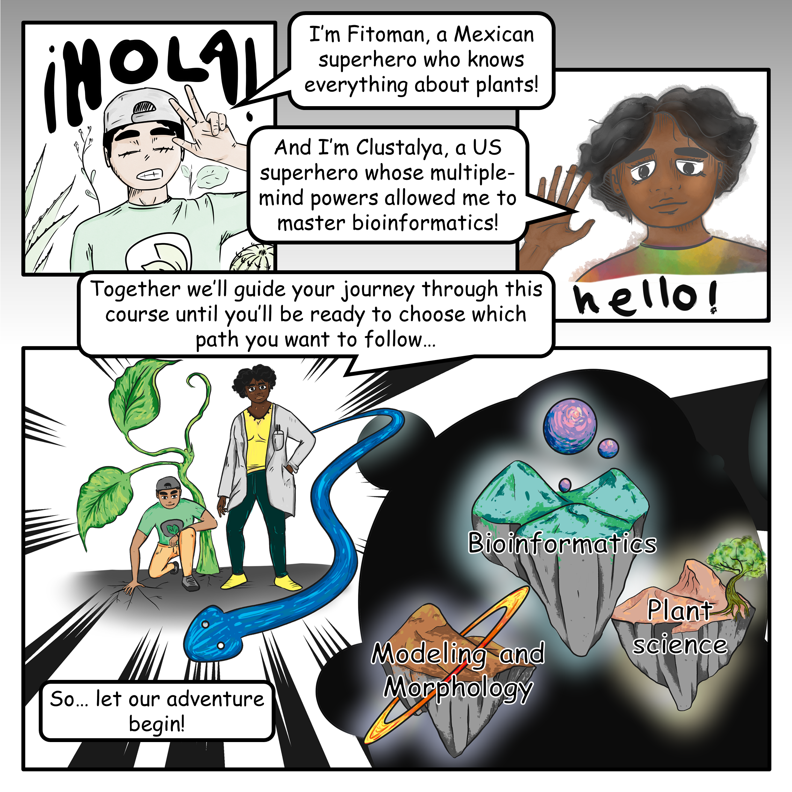
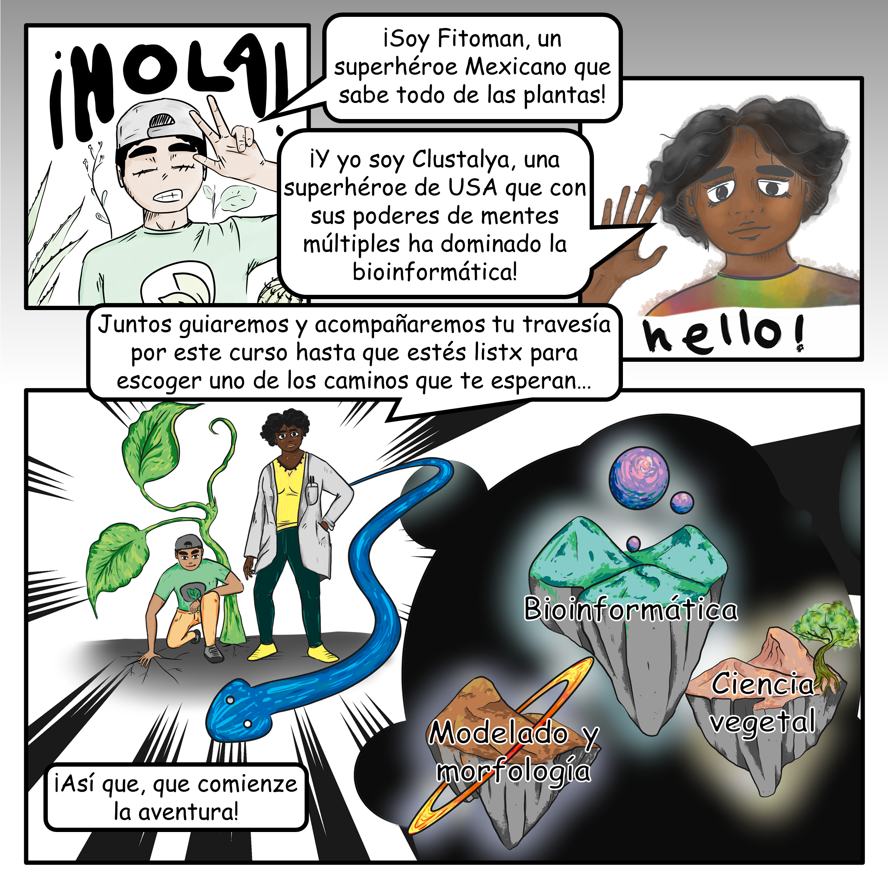

# Plants&Python :sunflower: :snake: :computer:
***:flag_us: a series of lessons in coding, plant biology, computation, and bioinformatics***  
***:flag_mx: una serie de lecciones de programación, biología vegetal, cómputo, y bioinformática***

Jupyter Book: [https://plantsandpython.github.io/PlantsAndPython](https://plantsandpython.github.io/PlantsAndPython)
_______

## **Welcome to / Bienvenid@ a Plants&Python**  
*Para español, haga click en configuración, seleccione "español" debajo de los subtítulos.*  
*Traducción por Dr. Alejandra Rougon ([UNAM ENES León](https://enes.unam.mx/), México)*   
<iframe width="560" height="315" src="https://www.youtube.com/embed/wXAf_XSNeZ4?si=ljIrvyZdL0jHmnls" title="YouTube video player" frameborder="0" allow="accelerometer; autoplay; clipboard-write; encrypted-media; gyroscope; picture-in-picture; web-share" referrerpolicy="strict-origin-when-cross-origin" allowfullscreen></iframe>  

## **Introduction to / introducción a Plants&Python**

=== "English :flag_us:" 

    ### Introduction Illustration

    

    **Illustration by *Eddy Mendoza-Galindo*.**

    **Image description:** first panel shows Fitoman holding up a peace sign with eyes closed and cap backwards and "Hola!" written behind him. He is saying "I'm Fitoman, a mexican superhero who knows everything about plants!". The second panel shows Clustalya waving saying "And I'm Clustalya, a US superhero whose mutiple mind powers allowed me to master bioinformatics!". The third panel shows Fitoman kneeling, his hand to the ground and a giant plant growing behind him, and Clustalya standing beside him in a lab coat with a giant serpent slithering around her. Next to them are rocky worlds floating in space labelled as "Modeling and Morphology", "Bioinformatics", and "Plant Science". The text says "So...let our adventure begin!"

    ______
    ### Motivation and rationale

    **These lessons assume no prior experience in plant biology or coding.** It is impossible to teach the breadth of plant biology and data science in just a few lessons. Rather, these lessons select specific examples in which mathematical and modeling approaches intersect with the biology of plants.

    Coding in plant biology can be intimidating to those with no prior experience. These materials are designed to make these disciplines welcoming. **A diversity of perspectives  is vital to combat the grandest challenges of our time and there is no room for gatekeeping or shaming. Your contributions to the computational plant science community are needed and precious.**

    These materials are only meant as an introduction for you to **develop *your* skills** to **pursue *your* intended impacts**. There are no wrong answers: use these materials in whatever way is useful for ***you*** to further your education and career. Share these materials with others in the same spirit  and spread your knowledge.

    Above all, find ***joy*** in the way that mathematics and modeling can  reveal the underlying beauty of plants. 

    _______
    ### Plants inspire us

    The mathematical and computational concepts in these lessons are inspired by plants. 

    **Plants are the original computers:** they ***iteratively*** produce organs like leaves and   flowers with intricate shapes precisely arranged in exquisite  patterns.

    **Plants are the original mathematicians:** they ***calculate*** numbers like the Golden ratio, intrinsic to how they grow and develop. 

    Plant morphology is encoded by DNA at the genomic level and the beautiful forms plants produce result from complex spatial temporal gene expression patterns. Plants have evolved unimaginable diversity over millions of years that humanity has used to feed, clothe, shelter, and medicate itself. In addition, plants sustain the earth's biodiversity,  contributing to thriving ecosystems. Plants respond to their environment, both evolving over hundreds of millions of years and responding to the current climate crisis over only decades. 

    _______
    ### Coding basics and bioinformatics

    The first half of this course covers Python and coding basics. You'll learn about variables, functions, lists, and indexing. How to visualize your data using  matplotlib. How to calculate the Golden angle with loops and model the growth of a sunflower.  And how to analyze data using pandas. Some of the examples in these lessons include plotting  out the shapes of different grapevine species, modeling the growth of sunflowers and looking for patterns in their form, and looking at the harvest dates of grapevines in Europe over centuries and how a warming planet has made their harvest dates earlier.

    In the second half of the course, you'll be learning about computation and bioinformatics. You'll learn how to use the command line; how to access high performance computing resources; how to store, edit, manipulate, and use biological sequences like DNA; you'll learn about genome assembly and comparative genomics; and you'll also learn about short read gene expression analysis.

    _______
    ### Python and Jupyter

    The structure of these lessons is of course based in Python. Python is a versatile coding language. It's good for modeling and for computation. It also contains Biopython, which contains tools for genomics and  bioinformatics that you'll be learning about. The other coding language that's used often in biology is R. R is better for specialized needs like statistics, while Python is more diverse. The coding lessons though you learn in this course can be transferred to R. 

    Our lessons  will take place in an environment called Jupyter. Jupyter notebooks support learning to code,  research, and reproducing and sharing code and embedded in these notebooks will be video tutorials, like this one, which are meant to allow you to go over the concepts at your own pace. And please, feel free to stop, rewind, and go over material as is necessary. 

    This course brings together plant biologists who may not know how to code together with data scientists who may not know about biology or plants. If you are familiar with the  presented topics always look deeper, look to the synthesis between plant biology and data science. What is the underlying biology of the unsolved problem? What mathematical concepts remain to be explored? What is the grand challenge? You can always take this material to the next level if you have already mastered what is being presented. Research further and push the boundary. Again, above all find joy in the way that mathematics and modeling reveals the underlying beauty of plants.  

    ***Thank you and best wishes on your learning and research journey!***

=== "Español :flag_mx:"

    ### Ilustración de introducción

    

    **Ilustración de *Eddy Mendoza-Galindo*.**

    **Descripción de la imagen:** el primer panel muestra a Fitoman sosteniendo un signo de la paz con los ojos cerrados y la gorra hacia atrás y "¡Hola!" escrito detrás de él. Está diciendo "¡Soy Fitoman, un superhéroe Mexicano que sabe todo de las plantas!". El segundo panel muestra a Clustalya saludando diciendo "¡Y yo soy Clustalya, un superhéroe de USA que con sus poderes de mentes múltiples ha dominado la bioinformática!". El tercer panel muestra a Fitoman arrodillado, con la mano en el suelo y una planta gigante creciendo detrás de él, y a Clustalya de pie a su lado con una bata de laboratorio y una serpiente gigante deslizándose a su alrededor. Junto a ellos hay mundos rocosos flotando en el espacio etiquetados como "Modelado y morfología", "Bioinformática" y "Ciencia vegetal". El texto dice "¡Así que, que comienze la aventura!".

    ***Traducción por Dr. Alejandra Rougon (UNAM ENES León, México)***

    ______
    ### Motivación y razonamiento

    **En estas lecciones se asume que no tienes experiencia previa en biología vegetal o programación.** Es imposible enseñar la amplitud de la biología vegetal y la ciencia de datos en unas pocas lecciones. Más bien, estas lecciones seleccionan ejemplos en los que los enfoques matemáticos y de modelización se intercalan con la biología de las plantas.

    La programación en biología vegetal puede resultar intimidante para quienes no tienen experiencia previa. Estos materiales están diseñados para hacer que estas disciplinas no se sientan pesadas. **Una diversidad de perspectivas es vital para combatir los mayores desafíos denuestro tiempo y no hay lugar para guardarse ideas o avergonzarse. Tus contribuciones a la comunidad de ciencias computacionales en plantas son necesarias y valiosas.** 

    Estos materiales solo tienen la intención de ser una introducción para que **desarrolles ***tus*** habilidades** para **lograr el impacto que buscas.** No hay respuestas incorrectas: usa estos materiales de la manera que te sean útiles para promover tu educación y tu carrera. Comparte estos materiales con otros con el mismo espíritu y difunde tu conocimiento. 

    Sobre todo, ***disfruta*** de la forma en que las matemáticas y el modelado pueden revelar la belleza subyacente de las plantas. 

    ______
    ### Las plantas nos inspiran

    Los conceptos matemáticos y computacionales en estas lecciones están inspirados en plantas.

    **Las plantas son las computadoras originales:** ***iterativamente*** producen órganos como hojas y flores con formas complejas dispuestas con precisión en patrones exquisitos.

    **Las plantas son los matemáticos originales:** ***calculan*** números como la proporción áurea, intrínseca a cómo crecen y se desarrollan.

    La morfología de las plantas está codificada por el ADN a nivel genómico y las hermosas formas que producen las plantas son el resultado de complejos patrones de expresión de genes espacio-temporales. Las plantas han desarrollado una diversidad inimaginable durante millones de años que la humanidad ha utilizado para alimentarse, vestirse, abrigarse y medicarse. Además, las plantas mantienen la biodiversidad de la tierra, contribuyendo a los ecosistemas prósperos. Las plantas responden a su entorno, ambos evolucionando a lo largo de cientos de millones de años y respondiendo a la actual crisis climática a lo largo de solo décadas.

    _______
    ### Conceptos básicos de programación y bioinformática

    La primera mitad de este curso cubre Python y los conceptos básicos de programación. Aprenderá sobre variables, funciones, listas e indexación. Cómo visualizar sus datos usando matplotlib. Cómo calcular el ángulo dorado con bucles (loops), modelar el crecimiento de un girasol, y cómo analizar datos usando pandas. Algunos de los ejemplos de estas lecciones incluyen el graficado de las formas de diferentes especies de vid, el modelado del crecimiento de los girasoles y la búsqueda de patrones en su forma. También, veremos las fechas de cosecha de las vides en Europa durante siglos y analizaremos cómo un planeta en calentamiento ha adelantado sus fechas de cosecha.

    En la segunda mitad del curso, estarás aprendiendo sobre computo en bioinformática. Aprenderás a utilizar la línea de comandos; cómo acceder a recursos informáticos de alto rendimiento y cómo almacenar, editar, manipular y usar secuencias biológicas como el ADN. También aprenderás cómo ensamblar genomas, hacer análisis de genómica comparativa, y de expresión génica de lecturas cortas. 

    ______
    ### Python y Jupyter

    La estructura de estas lecciones están, por supuesto, basadas en Python. Python esun lenguaje de codificación versátil. Es muy bueno para modelado y para cómputo. También contiene Biopython, que contiene herramientas para genómica y bioinformática las cuales aprenderás a usar. El otro lenguaje de codificación que se usa a menudo en biología es R. R es mejor para necesidades especializadas como estadísticas, mientras que Python es mucho más diverso. Aunque las lecciones de programación que aprenderás en estecurso se pueden transferir a R. 

    Nuestras lecciones tendrán lugar en un entorno llamado Jupyter. En los cuadernos de Jupyter (Jupyter notebook) se facilita el aprendizaje de programación. También permite la investigación, reproducibilidad y el compartir código. Dentro de los cuadernos encontrarás los videos tutoriales, como este, que están destinados a permitirte repasar los conceptos a su propio ritmo. Y, por favor, siéntete libre de detener y regresar el video y repasar el material según sea necesario.

    Este curso reúne a biólogos de plantas que pueden no saber programar y a científicos de datos que tal vez no conozcan la biología o la biología de las plantas. Si estás familiarizado con los temas presentados siempre ve más allá, con mayor profundidad. Busca en lasíntesis entre la biología vegetal y la ciencia de datos. ¿Cuál es la biología subyacente del problema no resuelto? ¿Qué conceptos matemáticos quedan por ser explorados? ¿Cuál es el gran desafío? Siempre puedes llevar este material al siguiente nivel, si ya dominas lo que se está presentando. Investiga más y amplía los límites del conocimiento. De nuevo, sobre todo encuentra alegría en la forma en que las matemáticas y el modelado revelan la belleza subyacente de las plantas.

    ***¡Gracias y los mejores deseos en tu viaje de aprendizaje e investigación!***

